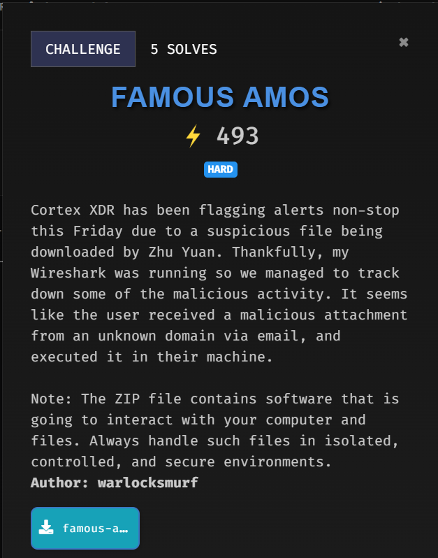
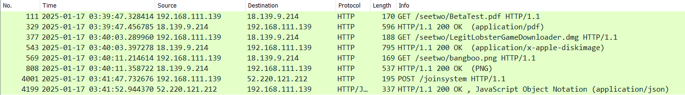
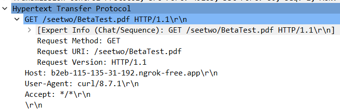
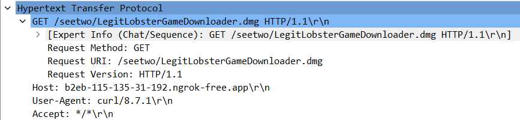
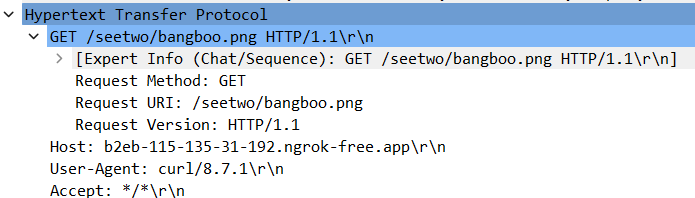
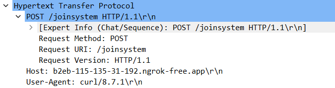
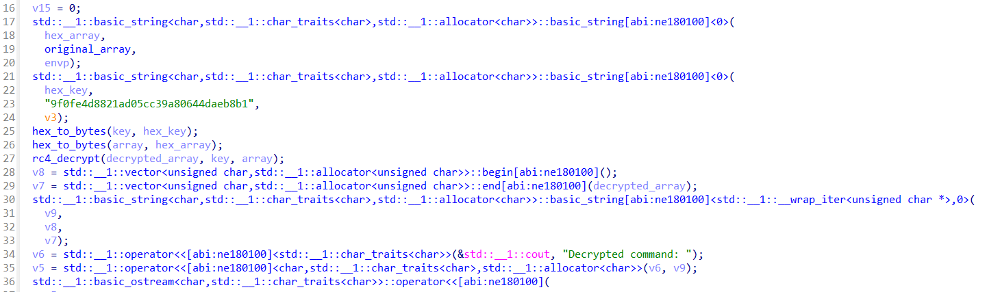

---

# Analysing Network Traffic

Given was a `.pcap` file to begin with.

```
$ file famous-amos.pcapng
famous-amos.pcapng: pcapng capture file - version 1.0
```

Upon analysing the traffic captured, there was several interesting HTTP packets to look at.



Here, `192.168.111.139` downloads three files from ngrok server using `curl`, which is `BetaTest.pdf`, `LegitLobsterGameDownloader.dmg` and `bangboo.png`







Then, it makes a POST request to upload something to `/joinsystem` directory.



Download all HTTP object to analyse it further.

---

# Reversing lobsterstealer

`BetaTest.pdf` and `bangboo.png` are just a normal file, nothing fancy in it.

```
$ file BetaTest.pdf bangboo.png
BetaTest.pdf: PDF document, version 1.7, 1 page(s)
bangboo.png:  PNG image data, 498 x 498, 8-bit/color RGB, non-interlaced
```

`LegitLobsterGameDownloader.dmg` was a compressed data.

```
$ file LegitLobsterGameDownloader.dmg
LegitLobsterGameDownloader.dmg: zlib compressed data
```

Extracting the file will reveal a Mach-O binary named `lobsterstealer`

```
$ file lobsterstealer
lobsterstealer: Mach-O 64-bit x86_64 executable, flags:<NOUNDEFS|DYLDLINK|TWOLEVEL|WEAK_DEFINES|BINDS_TO_WEAK|PIE>
```

Disassabmle it in IDA and rename some of the variables to understand better.



From the main function, it declares an array of hex to a variable `hex_array` and a key in hex as `hex_key`. Then, convert those two to bytes.

Next, it decrypt the the array using RC4 method with the key declared.

Using the same process, create a python script to decrypt it.

```py
import binascii

def rc4_decrypt(key, ciphertext):
    S = list(range(256))
    j = 0
    for i in range(256):
        j = (j + S[i] + key[i % len(key)]) % 256
        S[i], S[j] = S[j], S[i]

    i = j = 0
    plaintext = bytearray()
    for byte in ciphertext:
        i = (i + 1) % 256
        j = (j + S[i]) % 256
        S[i], S[j] = S[j], S[i]
        plaintext.append(byte ^ S[(S[i] + S[j]) % 25x])
    return bytes(plaintext)

def hex_to_bytes(hex_string):
    return bytearray.fromhex(hex_string)

def decrypt_command(hex_key, hex_data):
    key = hex_to_bytes(hex_key)
    ciphertext = hex_to_bytes(hex_data)

    decrypted = rc4_decrypt(key, ciphertext)

    try:
        decrypted_command = decrypted.decode('utf-8')
        return decrypted_command
    except UnicodeDecodeError:
        return decrypted 

if __name__ == '__main__':
    key_hex = "9f0fe4d8821ad05cc39a80644daeb8b1"
    data_hex = "a37c59750ed63b04e4...44daeb8b1"

    decrypted_command = decrypt_command(key_hex, data_hex)
    print("Decrypted command:", decrypted_command)
```

Now the hex data in the array had been succesfully decoded.

# Analysing the osascript

The decoded data seems to be an [osascript](https://victorscholz.medium.com/what-is-osascript-e48f11b8dec6). Basically a powershell but for Mac OS.

```osa
osascript -e \'
set release to true
set filegrabbers to true

if release then
...
...
continued
...
...
```

Looking through the script suggest that this malware is capable of stealing user credentials, accessing browser-related files like cookies and login databases, and encrypts files and manipulates directories.

There's a function called `encryptFlag()`, as the name said, to encrypt flag.

This is how the function being called

```osa
encryptFlag(sussyfile, inputFile, outputFile)
```

`sussyfile` being declared as `bangboo.png`, which was mentioned earlier in this writeup.
`flag.png` was the original flag and `flag.enc` was the encrypted flag.
```osa
set sussyfile to "~/Downloads/bangboo.png"
set inputFile to "/tmp/flag.png"
set outputFile to "/tmp/flag.enc"
```

The `encryptFlag()` function uses AES CBC mode with the MD5 hash of `bangboo.png` as the key and the iv being the reversed string of the key

```osa
on encryptFlag(sussyfile, inputFile, outputFile)
	set hexKey to (do shell script "md5 -q " & sussyfile)
	set hexIV to (do shell script "echo \\"" & hexKey & "\\" | rev")
    do shell script "openssl enc -aes-128-cbc -in " & quoted form of inputFile & " -out " & quoted form of outputFile & " -K " & hexKey & " -iv " & hexIV
end encryptFlag
```

Using the information retrieved, decrypt the flag.

| Item | Value |
| --- | --- |
| Encryption | AES |
| Mode | CBC |
| Key |  MD5 of `bangboo.png` |
| IV |  Reversed value of Key | 

# Flag

