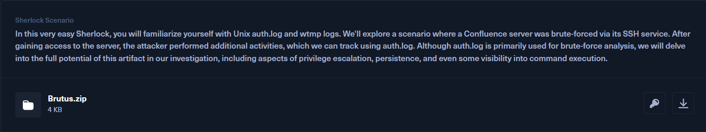
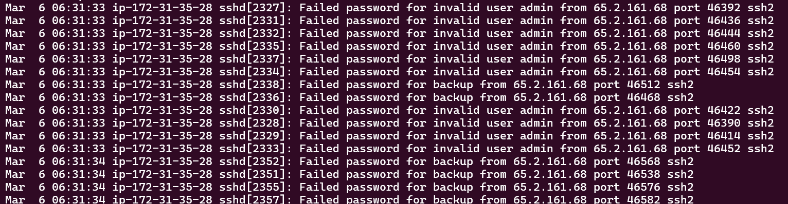
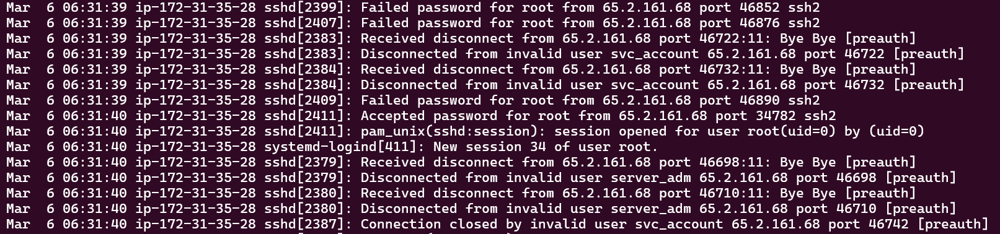
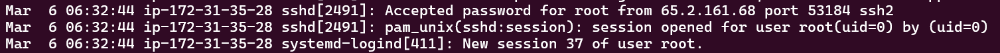
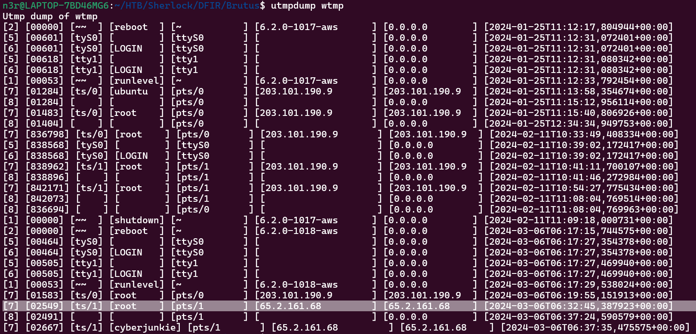
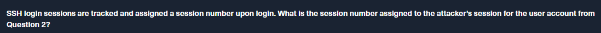
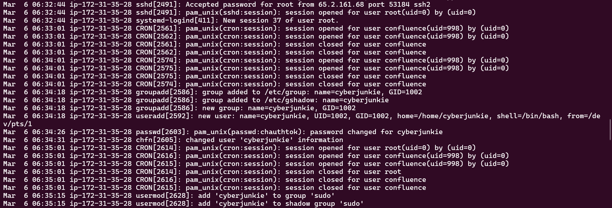
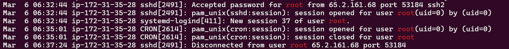
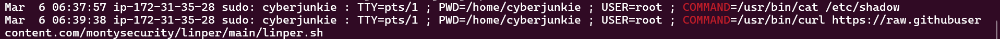
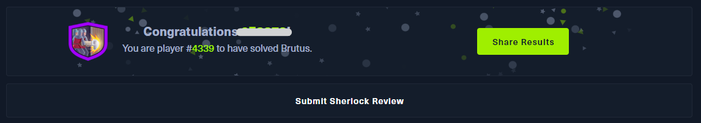

# Task 1

The provided auth.log shows that **65.2.161.68** is the IP address that performed the bruteforce attack.

It is because many failed login attempt within several seconds coming from that IP which indicate that the attacker is brute forcing login credentials.

> **Flag:** 65.2.161.68

# Task 2

Following the brute force progress, there is only one accepted login which is for username root, then it immediately disconnect, meaning that probably the brute force scripts are trying to finish the rest of the password list.

> **Flag:** root

# Task 3

Of course after the brute forcing process is done, the attacker try to login with the valid credentials manually.

Here are the first manual login attempt by the attacker. Take this part and relate it with the **wtmp** file given to get the exact timestamp the attacker logged in as root.

Using tools like **utmpdump**, we can dump the wtmp files and see all the details. 

The line highlighted on the picture below is related with picture above. 

We can see the same IP address login at a similar timestamp

> **Flag:** 2024-03-06 06:32:45

# Task 4

After any successful login, a session number will be assigned. Looking at the picture below, the user root logged in by the attacker being assigned as session number 37

> **Flag:** 37

# Task 5

Right after the attacker login manually, the attacker created a new user named **cyberjunkie** and give a high privilege to it **by adding the user to the sudo group**

> **Flag:** cyberjunkie

# Task 6

Understand what the attacker is doing, we can conclude that the attacker is using [T1136.001](https://attack.mitre.org/techniques/T1136/001/) for the attack.

> **Flag:** T1136.001

# Task 7

The session last for **279 seconds** based on the findings in the **auth.log**.

We can easily use the command `strings auth.log | grep root` to only filter out the logs related to root

> **Flag:** 279

# Task 8

To search for command executed in auth.log, we can use command `strings auth.log | grep COMMAND` to filter it out.

> **Flag:** https://raw.githubusercontent.com/montysecurity/linper/main/linper.sh

---

